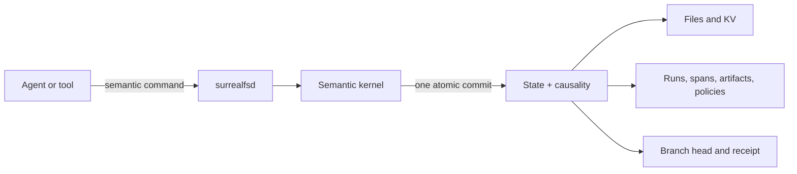
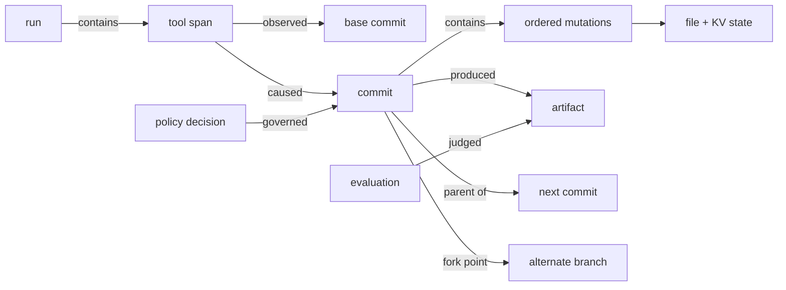
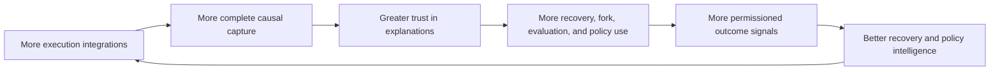
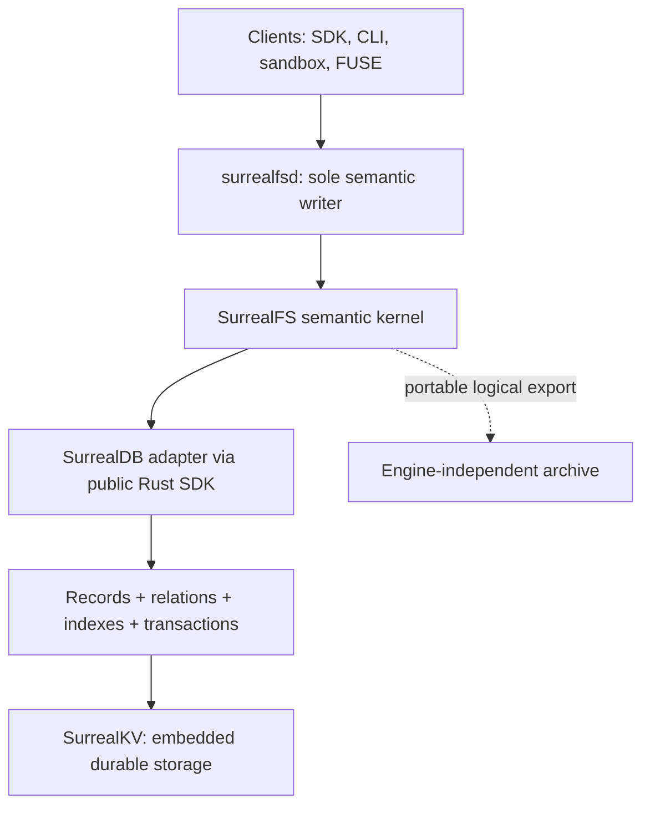

# SurrealFS: the causal workspace for agents

> Every agent action should produce an attributable state transition, not another opaque log.

## The decision in one page

SurrealFS should be built as a **causal, forkable execution substrate for AI agents**. It should not
be pitched as a new filesystem, a SurrealDB wrapper, or a faster local database.

The product promise is that a team can answer three expensive questions with evidence:

1. **Explain:** Why does this file, value, or artifact exist, and which exact action produced it?
2. **Fork:** Can we retry from the exact pre-action state without copying the whole workspace?
3. **Govern:** Can we prove which policy, approval, input, tool, and model governed the result?

The recommended architecture is one embedded SurrealDB instance backed by SurrealKV, owned by one
local daemon. Filesystem state, agent KV, execution records, graph relations, idempotency receipts,
and branch heads move in one semantic transaction.

The investment recommendation is deliberately narrower than “rebuild AgentFS”:

> **Fund a gated evidence sprint for the atomic vertical slice. Do not fund broad POSIX coverage or
> multiple storage backends until the causal recovery/fork workflow is proven with design partners.**

## The problem

Agent state is currently fragmented across files, key-value memory, model traces, tool logs,
sandbox snapshots, Git commits, generated artifacts, and evaluation systems. When an agent fails or
produces an important result, teams reconstruct causality after the fact:

- correlate timestamps from several systems;
- guess which tool call caused which mutation;
- copy directories before retrying;
- rerun expensive work from an approximate starting point;
- trust provenance assembled after the result already exists;
- manually compare actions, state, and artifacts across attempts.

Each component can be individually correct while the overall explanation is false. Git knows files
but usually not agent intent or runtime KV. Tracing knows actions but usually not the exact state
transition. A snapshot knows state but not why it changed. A graph added asynchronously can lag or
disagree with the source of truth.

SurrealFS makes the state-transition boundary the capture boundary.

If the commit succeeds, state and provenance are visible together. If it fails, neither becomes
canonical. That is the foundation on which explain, fork, recovery, evaluation, and governance can
be trusted.

## The product experience

Consider a coding agent that edits 37 files, runs a migration, calls a test tool, and produces a
release artifact before failing.

With SurrealFS, the operator can:

1. select the failed run and see its causal timeline;
2. ask which span introduced the first failing state;
3. inspect the exact file and KV diff caused by that span;
4. mount or read the workspace immediately before it;
5. fork that commit without copying the repository;
6. retry with a different model, prompt, tool, or policy;
7. compare the two attempts by action, state divergence, artifact, and evaluation;
8. export a verifiable evidence bundle.

The graph is not a dashboard assembled from timestamps. It is linked to the same commit that
changed state.

## The wedge

The first product should not ask customers to replace their general filesystem. It should solve one
workflow where causal state has immediate economic value:

**Recommended wedge: debug, recover, and compare long-running coding-agent attempts.**

This wedge has the right properties: failures are common, reruns are expensive, state matters,
actions span multiple tools, and the result can be evaluated. Artifact provenance and regulated
chain-of-custody are credible later wedges, but they introduce more policy and compliance surface
before the core is proven.

A first demo should show one harmful tool action, an exact pre-action fork, a corrected retry, and a
causal comparison. The demo should not lead with SurrealQL, storage benchmarks, or a graph browser.

## Why this is different

| Existing approach | What it captures well | What remains missing |
|---|---|---|
| Git | Human-oriented file history | Runtime KV, tool causality, uncommitted state, policy, agent-native forks |
| Tracing/observability | Spans, timing, errors | Exact atomic attribution to file and KV state |
| VM/container snapshot | Machine or directory state | Semantic mutations, intent, provenance, efficient comparison |
| Database audit log | Record changes | Filesystem semantics, agent ontology, fork/recovery product |
| Graph database | Traversal and relationships | Ownership of the mutation boundary and trustworthy capture |
| SurrealFS | State, action, causality, history, and branches in one commit | Must still prove durability, hot-path performance, and demand |

No single feature is unique. The defensibility comes from the **compound guarantee** and the
workflows it enables.

## The moat

SurrealDB and SurrealKV are not the moat. They are enabling infrastructure. The moat has five
reinforcing layers:

1. **Causal correctness:** years of edge cases around retries, crashes, concurrent writers, file
   semantics, open handles, external effects, and partial outcomes.
2. **A framework-neutral execution ontology:** one durable language for runs, actions, commits,
   mutations, artifacts, policies, evaluations, and forks.
3. **Compound workflows:** explain, rewind, fork, compare, recover, evaluate, and govern from the
   same facts.
4. **Capture integrations:** control at filesystem, sandbox, SDK, MCP/tool, CI, and agent-framework
   boundaries without creating parallel truths.
5. **Permissioned outcome intelligence:** privacy-preserving patterns that improve failure
   classification, recovery suggestions, evaluations, and policy defaults.

The hard-to-copy asset is not a proprietary byte layout. It is the combination of semantic
coverage, conformance evidence, trusted workflows, integration distribution, and—only with explicit
permission—outcome data. An engine can be replaced; those assets should survive.

### How we know whether the moat is forming

Measure product behavior, not stored bytes:

- durable mutations with a known causal span;
- artifacts with complete derivation chains;
- time to explain a failed output;
- recovery success from captured state;
- repeated use of fork/compare rather than directory copy and rerun;
- evaluation reproducibility from identical starting commits;
- policy decisions supported by direct evidence;
- number of frameworks sharing the same ontology;
- improvement from permissioned recovery/evaluation signals.

If users only store files, only browse a graph, or can obtain equivalent value from Git plus tracing,
the moat thesis has failed.

## Why SurrealDB + SurrealKV

The workload needs both operational state access and causal graph access:

- point/range reads for paths, inodes, directory entries, extents, branch heads, KV, and receipts;
- graph traversal for runs, spans, commits, artifacts, policies, evaluations, and forks;
- one transaction that publishes both sets of facts;
- local/offline operation with one daemon-owned directory.

This is one database stack, not two asynchronously synchronized databases. SurrealDB owns the
record/query/transaction model; SurrealKV is its embedded persistence engine.

Raw SurrealKV alone remains a contingency, not a v1 mode. Shipping both would force the team to own
two schemas, index implementations, graph traversal, migration paths, query surfaces, and crash
matrices. That work does not strengthen the initial wedge.

## What the current private SurrealDB tree changes

The architecture was revalidated on 2026-08-04 against local revision
`e68539867728aa6412a75c7669b0b33c30c00feb` (`v3.3.0-nightly`, SurrealKV `0.21.3`). The current tree
is materially different from the earlier reviewed revision:

- the public Rust SDK reaches the embedded engine through a typed engine boundary;
- datastore, keyspace, KVS, local engine, and index/runtime responsibilities are more modular;
- the public SDK exposes explicit client-side transactions;
- embedded mode advertises live queries and logical export/import;
- startup performs datastore version checks, migration-ledger processing, and bootstrap before
  serving;
- SurrealKV `sync=every` groups commits behind one durable WAL flush;
- SurrealKV `0.21.3` carries compaction-fsync and memtable-rotation fixes.

This increases confidence in the stack's direction. It does **not** remove the need for SurrealFS
crash tests. The 0.21.3 fixes are evidence that compaction and SIGKILL belong in the launch gate.

The source also exposes an important boundary: `engine-api`, `engine-local`, `datastore`, `kvs`,
`kvs-any`, and `kvs-surrealkv` are internal and explicitly unstable. SurrealFS must depend only on
the public `surrealdb` crate and checked-in SurrealQL. It must not use the hidden
`unstable_from_datastore` path.

See the [current source audit](docs/15-current-surrealdb-audit.md) for code paths, test evidence, and
open issues.

## What is proven and what is not

### Evidence already obtained

- the current shared SurrealKV adapter suite: 73 passed, 0 failed, 8 ignored;
- the SurrealKV adapter's own unit tests: 3 passed;
- targeted current public-SDK tests passed for client transactions, session isolation, live select,
  export/import, versioned select, and versioned export/import;
- engine startup now includes explicit storage-version and migration handling.

### Proof still required

- acknowledged commits survive deterministic kill points and compaction load;
- an unknown commit outcome is reconciled by deterministic request ID, never blindly replayed;
- expected-head conflicts cannot publish partial state or graph edges;
- hot filesystem reads meet an agreed p95/p99 latency budget;
- 1k and 10k mutation commits stay within transaction/memory limits;
- dropping the public SDK connection reliably releases the directory and completes shutdown, or a
  supported awaited close API is provided;
- logical export plus SurrealFS content packs reconstructs every state root;
- a safe stopped/quiesced physical-copy procedure exists until a supported physical snapshot API
  is available;
- licensing supports the exact embedded and hosted product models.

## The investment plan

### Approve now: Phase 0 evidence package

Commit a small senior team to produce:

1. a working atomic commit containing file/KV state, immutable history, graph edges, branch movement,
   and idempotency receipt;
2. deterministic before/after-commit kill tests plus reopen verification;
3. a realistic filesystem and graph benchmark against agreed baselines;
4. an engine-independent logical export/restore of the vertical slice;
5. a shutdown/reopen/lock-release contract test using only public SDK APIs;
6. a legal decision on the pinned SurrealDB distribution model;
7. discovery evidence from 5–10 design partners, with at least three willing to test the prototype.

### Approve next only if Phase 0 passes

Build one end-to-end workflow:

> run → tool action → atomic file/KV commit → causal explanation → pre-action fork → alternate retry
> → semantic comparison

Keep the interface direct and SDK-first. Add broad FUSE compatibility, multi-user hosting, general
merge, and multiple engines only after repeated workflow adoption.

### Stop or narrow if

- any acknowledged commit is lost or partially visible;
- point/range overhead is structurally outside the product latency budget;
- logical recovery cannot reproduce state roots;
- licensing makes the intended economics unacceptable;
- design partners do not repeatedly use a workflow that requires causal state;
- the graph remains a demo surface rather than part of recovery, evaluation, or governance.

## Likely questions

### Is this just Git for agents?

Git is an important analogy for commits, branches, and content identity. SurrealFS additionally owns
runtime KV, uncommitted workspace operations, tool spans, policies, evaluations, artifacts, and the
atomic link between action and state. It should integrate with Git, not pretend Git is irrelevant.

### Why not add this to tracing?

A tracer observes events. SurrealFS governs the state-transition boundary. Observation alone cannot
prove that a span and a filesystem/KV mutation committed together.

### Why not SQLite?

SQLite is a mature and credible performance/reliability baseline. It could implement this design,
but SurrealFS would own more relational mapping and graph traversal machinery. The decision is not
that SQLite is bad; it is that SurrealDB may let the team reach the differentiated workflows sooner.
Benchmark it during Phase 0 and change adapters if that thesis is wrong.

### Is SurrealDB the lock-in?

No. The domain command protocol, application commits, canonical IDs, state roots, and logical export
are the durable product contract. Database types do not cross the adapter. If replacement cannot be
done without redefining product semantics, the architecture has failed.

### Can SurrealFS replay an agent deterministically?

It can reconstruct retained state exactly. Behavioral replay is only as deterministic as captured
models, prompts, network responses, time, randomness, tools, and external side effects. The product
must label this distinction honestly.

## The ask

Approve the Phase 0 evidence package and the coding-agent recovery/fork wedge. Judge the result on
causal completeness, crash safety, workflow adoption, recovery time, and engine replaceability—not
on the novelty of the database choice.

If those proofs pass, SurrealFS has a credible route to becoming the system of record for how agents
transform state. If they fail, the gates prevent an expensive filesystem rewrite from becoming the
strategy by default.
