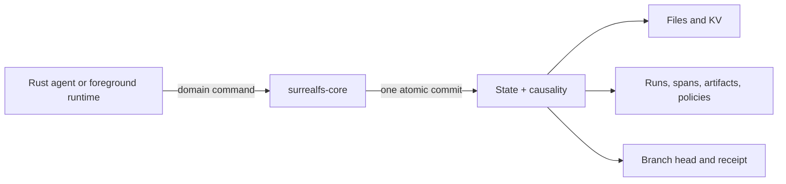
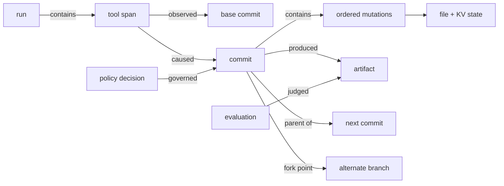
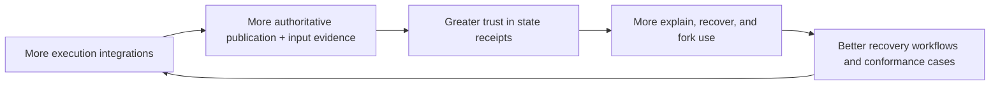
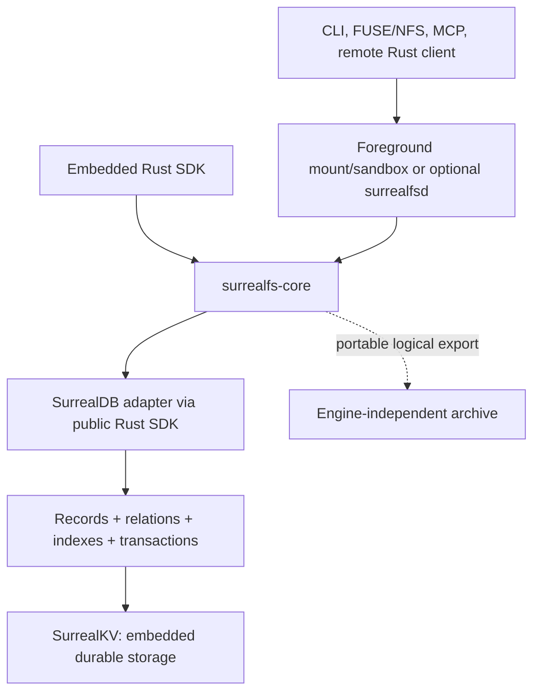

# SurrealFS: the causal state filesystem for agents

> Every authoritatively published agent action becomes a verifiable, forkable, recoverable state
> transition over files and runtime state.

## The decision in one page

SurrealFS should build a reusable Rust capability for the **AgentFS/TigerFS agent-filesystem and
persistent-state category**, with the lowest-risk first shipping posture as a durable-workspace and
recovery feature inside Spectron or another agent runtime that owns the action boundary. A standalone
product is an option only if the product and distribution gates pass. The filesystem is the
compatibility surface. The differentiated hypothesis is exact action-to-state publication plus
evidence-graded, dependency-aware recovery across files, runtime KV, artifacts, and agent execution.
The standalone market and moat are not validated yet.

It should not be pitched as a SurrealDB wrapper, a faster local database, or versioned storage alone.
Those are implementation capabilities, not the reason a customer switches.

The product promise is that a team can answer four expensive questions with evidence:

1. **Explain:** Why does this file, value, or artifact exist, and which exact action produced it?
2. **Recover:** Where did the first harmful state appear, what can the available input evidence prove
   depends on it, and what is the minimum safe recovery point?
3. **Fork:** Can we retry from the exact pre-action state without copying the whole workspace?
4. **Prove:** Can we verify which principal, tool, policy, model, and verified/declared/unknown inputs
   governed the transition?

The chosen architecture is one embedded SurrealDB instance backed by SurrealKV and one embeddable
Rust semantic kernel. One process exclusively owns each store: initially the Rust SDK caller, later
a foreground mount/sandbox runtime, or optionally `surrealfsd` when multiple clients, remote access,
or persistent workers justify it. Filesystem state, agent KV, execution records, graph relations,
immutable roots, idempotency receipts, and branch heads move in one semantic transaction. Phase 0
validates that stack against a backend-neutral reference model, crash/invariant gates, representative
product workloads, and independent customer evidence. No second adapter or AgentFS extension is planned.

The investment recommendation is deliberately narrower than “match every AgentFS and TigerFS
feature before launch”:

> **Fund a gated evidence sprint for the atomic vertical slice. Do not fund broad POSIX coverage or
> multiple production storage backends until the causal recovery/fork workflow is proven with design
> partners.**

## The problem

Agent state is currently fragmented across files, key-value memory, model traces, tool logs,
sandbox snapshots, Git commits, generated artifacts, and evaluation systems. When an agent fails or
produces an important result, teams reconstruct causality after the fact:

- correlate timestamps from several systems;
- guess which tool call caused which mutation;
- copy directories before retrying;
- rerun expensive work from an approximate starting point;
- trust provenance assembled after the result already exists;
- manually compare actions, state, and artifacts across attempts.

Each component can be individually correct while the overall explanation is false. Git knows files
but usually not agent intent or runtime KV. Tracing knows actions but usually not the exact state
transition. A snapshot knows state but not why it changed. A graph added asynchronously can lag or
disagree with the source of truth.

SurrealFS makes the state-transition boundary the capture boundary.



If the commit succeeds, state and provenance are visible together. If it fails, neither becomes
canonical. That is the foundation on which explain, fork, recovery, evaluation, and governance can
be trusted.

## The product experience

Consider a coding agent that edits 37 files, runs a migration, calls a test tool, and produces a
release artifact before failing.

With SurrealFS, the operator can:

1. select the failed run and see its causal timeline;
2. ask which span introduced the first failing state;
3. inspect the exact file and KV diff caused by that span;
4. see which later actions observed or depended on that state;
5. determine whether selective rollback is safe or a pre-action fork is required;
6. mount or read the workspace immediately before it;
7. fork that commit without copying the repository;
8. retry with a different model, prompt, tool, or policy;
9. compare the two attempts by action, state divergence, artifact, and evaluation;
10. export a verifiable evidence bundle.

The graph is not a dashboard assembled from timestamps. It is linked to the same commit that
changed state.



## The initial market hypothesis

The first product should not ask customers to replace their general filesystem. The leading market
hypothesis is:

> **Platform teams operating concurrent or long-horizon agents over shared durable state need exact
> transition proof and selective recovery when Git, rewind, tracing, and whole-sandbox snapshots are
> insufficient.**

The economic value must come from human investigation time, cross-agent contamination, retained
expensive state, irreversible or ambiguous effects, or a proof obligation. Falling token and
snapshot costs make “avoid one model rerun” an inadequate primary case. Generic governance is also
too broad: cloud and observability vendors already bundle identity, policy, trace, and audit features.

A coding-agent failure remains the first demo because it is legible and testable. It should show one
harmful tool action, an exact pre-action fork, a corrected retry, and a causal comparison. The demo is
not evidence that individual coding-agent developers are the buyer and should not lead with
SurrealQL, storage benchmarks, or a graph browser.

## The market position

SurrealFS enters an existing category rather than inventing one. AgentFS and TigerFS prove that
agents need filesystem-compatible, persistent, inspectable state. SurrealFS must match enough of
their practical surface to be adoptable, then win on the logical action and recovery model.

| Product or category | What it already proves | Gap SurrealFS should own |
|---|---|---|
| [AgentFS](https://github.com/tursodatabase/agentfs) | Embedded filesystem + KV + tool log, SDKs, mounts, sandboxing, sync | These are separate state/log APIs and transactions; application history, causal commits, and action-level branches are not core schema guarantees |
| [TigerFS](https://github.com/timescale/tigerfs) | ACID filesystem, history, user attribution, savepoints, atomic multi-file undo, service forks | History records physical filesystem operations rather than exact tool actions; selective per-user undo is unsafe under some interleaving; history can be bypassed by direct table access |
| Git and Docker Agent snapshots | File history, worktree isolation, turn-level undo | Runtime KV, artifacts, ignored/large state, subprocess causality, and atomic action boundaries |
| E2B, Daytona, and VM snapshots | Full-environment checkpoints, restore, and fork | The snapshot is opaque: it does not explain individual mutations or calculate a minimal safe recovery set |
| [Claude Code checkpoints](https://code.claude.com/docs/en/checkpointing) | Automatic file checkpoints and session rewind | Bash/external/network state and cross-agent dependency recovery remain outside the guarantee |
| [Cloudflare Computer](https://blog.cloudflare.com/cloudflare-computer/) and runtime-owned workspaces | Durable authoritative filesystem plus runtime audit/control | A sidecar cannot claim atomic causality; SurrealFS must become the backend or a conformed transactional bridge |
| LangGraph and durable workflows | Declared workflow-state checkpoints, retry, and replay | Uninstrumented subprocess files and state outside the workflow schema |
| LangSmith, cloud agent governance, Braintrust, and OpenTelemetry | Tool trajectories, policy/audit, evaluations, and a growing common agent vocabulary | Exact state-transition proof and dependency-aware recovery are not their general contract |
| SurrealFS target | Filesystem + KV state versioned by logical agent action | Must prove publication coverage, honest input evidence, recovery value, durability, performance, and adoption |

### What Cloudflare Computer changes

Cloudflare Computer is useful primary evidence, but it does not justify copying its entire design.
Its preview [`@cloudflare/dofs`](https://github.com/cloudflare/computer/tree/main/packages/dofs)
package evaluated AgentFS and rebuilt the filesystem because Cloudflare's sync requires hash-addressed
chunks and shared manifests, while AgentFS stores inline inode/chunk bytes. Cloudflare still adopted
parts of AgentFS's metadata vocabulary and treats its
[published specification comparison](https://github.com/cloudflare/computer/blob/main/docs/03_filesystem_schema.md#prior-art-and-selective-reuse)
as the reusable asset.

The objective conclusions are:

- content-addressed chunks, missing-object probes, resumable transfer, FUSE buffering, and storage
  tuning are credible table stakes, not a moat;
- a platform owner is likely to rebuild an SDK/runtime implementation that does not fit its storage
  boundary, so SurrealFS cannot depend on proprietary schema adoption;
- a portable receipt/root specification, golden vectors, and conformance corpus should be published
  before broad runtime integrations because those artifacts can survive an implementation rewrite;
- Cloudflare's current live-state sync, process-memory write buffers, and silent cross-container
  last-write-wins are not suitable recovery semantics for SurrealFS and must not be copied;
- Cloudflare's source is preview evidence and an engineering benchmark, not proof of customer demand
  or proof that SurrealFS has a moat.

This narrows the adoption decision: borrow correctness and performance techniques only where they
support immutable roots and explicit publication. Do not add Cloudflare-specific tables, a second
SQLite implementation, or a path-revision sync log merely to resemble `dofs`.

### What the POSIX-read critique changes

| Claim | Assessment | Design consequence |
|---|---|---|
| A standalone AgentFS/TigerFS competitor cannot work | Not proven, but distribution and commoditization make it a weak default assumption | Ship first as a reusable runtime/platform feature; fund standalone breadth only after repeated external adoption and willingness to pay |
| A durable workspace feature can be built quickly from established primitives | Directionally credible; a one-quarter date depends on the team, engine gates, and compatibility scope | Reuse AgentFS behavior/code where safe and `dofs` techniques where relevant; do not equate the vertical slice with complete parity |
| The valuable ideas are action-to-state binding and dependency-aware recovery, not filesystem novelty | Supported | Treat filesystem, mounts, chunks, and sync as adoption infrastructure rather than the moat |
| Both ideas fail at the filesystem layer | Too broad | Exact action-to-state publication still works for a private action workspace; exact fine-grained dependency inference does not follow from that fact |
| A POSIX surface cannot reliably reveal the exact semantic read set of an arbitrary subprocess tree | Supported | Never claim complete input capture from FUSE/NFS/syscall traces; use verified API objects, declared inputs, or conservative scopes |

The inversion is useful: a runtime such as Spectron can mediate model/tool inputs and assign one
private workspace to one logical action. SurrealFS then binds the resulting state exactly while the
runtime supplies stronger input evidence. Unmodified POSIX subprocesses remain supported, but their
read observations are hints and their safe dependency scope defaults to the entire base root plus
explicitly unknown external inputs.

### Table stakes for direct competition

SurrealFS must provide enough of the category baseline to be credible:

- a filesystem surface usable by ordinary tools plus the direct Rust SDK;
- files and KV in one logical repository;
- local-first, crash-safe operation;
- explicit snapshots, branches, timeline, and diff;
- content-addressed deduplication and portable export/import;
- encryption, retention, quotas, and sandbox compatibility;
- a documented, tested filesystem subset rather than an implied full POSIX promise.

These capabilities get SurrealFS considered. They do not create defensibility.

### The differentiated promise

AgentFS tells the user what is stored. TigerFS tells the user which filesystem operations happened.
Snapshot systems restore the whole environment. Tracing systems show what an agent attempted.

> **SurrealFS tells the user which logical action changed the exact state, what later work depended on
> it, and how to recover safely.**

No single feature is unique. The defensibility comes from making that compound guarantee trustworthy
across real agent execution surfaces.

## The core primitive: a state-transition receipt

Every durable action produces a portable receipt whose identity does not depend on SurrealDB:

```text
principal + store-owner-issued workspace capability or declared embedded action + capture grade
run + trace/span + tool + request digest
before filesystem/KV root -> ordered mutations -> after filesystem/KV root
observed inputs + produced artifacts + external-effect intentions
policy/evaluation evidence + outcome + durability + optional signature/attestation
```

The receipt is committed with the state and branch head, links to OpenTelemetry trace identifiers, and
can be independently verified from logical export. Higher-assurance deployments may sign receipts and
anchor selected roots outside the repository. A timestamp-correlated trace is not equivalent to this
receipt because it did not participate in publishing the state transition. Trace context provides
interoperable correlation; it is never accepted as the authority to publish a workspace.

Receipts expose one of four capture grades: `AUTHORITATIVE_ENFORCED` for SurrealFS publication plus
verified process scope, `AUTHORITATIVE_DECLARED` for an atomic embedded caller whose action identity
is trusted, `TRANSACTIONAL_BRIDGE` for a vendor-owned state transaction that includes the receipt and
passes conformance, or `OBSERVED` for sidecar/checkpoint correlation. “Alongside” is never described
as atomic.

The external portion is not a distributed-rollback claim. The
[architecture contract](docs/03-system-architecture.md#external-effects-and-combined-recovery)
specifies durable intent-before-dispatch, capability-graded reconciliation, compensation,
persistent divergence, and a combined recovery workflow that restores local state exactly without
pretending to reverse the outside world.

## The moat

SurrealDB and SurrealKV are not the moat. They are enabling infrastructure. A potential moat must
compound five reinforcing layers:

1. **Causal correctness:** edge cases around retries, crashes, concurrent writers, file semantics,
   open handles, nested processes, external effects, and partial outcomes become executable
   conformance evidence.
2. **Causal recovery intelligence:** identify the first harmful transition, calculate downstream
   dependencies, refuse unsafe selective rollback, choose the minimum safe fork, and retain or
   transplant independent later work.
3. **Publication coverage and honest input evidence:** control state publication across filesystem,
   direct SDK, sandbox, MCP/tool, CI, and agent-framework boundaries while recording inputs as
   verified, declared, conservatively scoped, or unknown—never inventing completeness from POSIX
   observation.
4. **Verifiable evidence and policy:** portable state receipts, integrity roots, customer-controlled
   signing, explicit external-effect records, and policy enforcement at the commit boundary.
5. **Integration distribution:** the same kernel semantics across the agent runtimes and execution
   environments customers actually use.

A framework-neutral domain model is required, but the vocabulary should align with OpenTelemetry and
open provenance formats. A proprietary ontology is not a moat. Permissioned outcome data may later
improve recovery suggestions, but privacy and label scarcity make it an option rather than a premise.



The hard-to-copy hypothesis is not a proprietary byte layout. It is the combination of semantic
coverage, years of conformance cases, dependency-aware recovery, trusted evidence, and integration
distribution. Incumbents can copy a schema or receipt more quickly than SurrealFS can copy their
distribution, so this compound advantage must be demonstrated rather than asserted.

The strategic test is multiplicative:

> **Moat = authoritative publication coverage × recovery usefulness × integration adoption × trust.**

If any factor is close to zero, the filesystem may still be useful, but it is not defensible.

### How we know whether the moat is forming

Measure product behavior, not stored bytes:

- durable mutations with a known causal span;
- explicit unknown/system attribution and detected bypass attempts, with no silent gaps;
- artifacts with complete derivation chains;
- time to identify the first causal divergence behind a failed output;
- recovery success from captured state;
- accuracy of downstream dependency and unsafe-rollback detection;
- repeated use of fork/compare rather than directory copy and rerun;
- evaluation reproducibility from identical starting commits;
- policy decisions and receipts supported by direct evidence;
- number of execution integrations passing the same causal conformance suite;
- successful independent verification of exported state-transition receipts;
- repeated cases where Git, agent rewind, tracing, and sandbox snapshots were insufficient;
- authoritative/conformed integrations rather than a growing count of observed-only adapters;
- willingness to pay for recovery/proof outcomes rather than storage or token savings alone.

If users only store files, only browse a graph, or can obtain equivalent value from Git plus tracing,
the moat thesis has failed.

## Why SurrealDB + SurrealKV

The workload needs both operational state access and causal graph access:

- point/range reads for paths, inodes, directory entries, extents, branch heads, KV, and receipts;
- graph traversal for runs, spans, commits, artifacts, policies, evaluations, and forks;
- one transaction that publishes both sets of facts;
- local/offline operation with one exclusively owned directory and no mandatory daemon.



This is one database stack, not two asynchronously synchronized databases. SurrealDB owns the
record/query/transaction model; SurrealKV is its embedded persistence engine.

Raw SurrealKV alone remains a contingency, not a v1 mode. Shipping both would force the team to own
two schemas, index implementations, graph traversal, migration paths, query surfaces, and crash
matrices. That work does not strengthen the initial wedge.

## What the current private SurrealDB tree changes

The architecture was revalidated on 2026-08-04 against local revision
`e68539867728aa6412a75c7669b0b33c30c00feb` (`v3.3.0-nightly`, SurrealKV `0.21.3`). The current tree
is materially different from the earlier reviewed revision:

- the public Rust SDK reaches the embedded engine through a typed engine boundary;
- datastore, keyspace, KVS, local engine, and index/runtime responsibilities are more modular;
- the public SDK exposes explicit client-side transactions;
- embedded mode advertises live queries and logical export/import;
- startup performs datastore version checks, migration-ledger processing, and bootstrap before
  serving;
- SurrealKV `sync=every` groups commits behind one durable WAL flush;
- SurrealKV `0.21.3` carries compaction-fsync and memtable-rotation fixes.

This increases confidence in the stack's direction. It does **not** remove the need for SurrealFS
crash tests. The 0.21.3 fixes are evidence that compaction and SIGKILL belong in the launch gate.

The source also exposes an important boundary: `engine-api`, `engine-local`, `datastore`, `kvs`,
`kvs-any`, and `kvs-surrealkv` are internal and explicitly unstable. SurrealFS must depend only on
the public `surrealdb` crate and checked-in SurrealQL. It must not use the hidden
`unstable_from_datastore` path.

The exact revalidation evidence and rerun checklist live in the
[implementation plan](RUST_SDK_PLAN.md#engine-pin-revalidation-checklist).

## What is proven and what is not

### Evidence already obtained

- the current shared SurrealKV adapter suite: 73 passed, 0 failed, 8 ignored;
- the SurrealKV adapter's own unit tests: 3 passed;
- targeted current public-SDK tests passed for client transactions, session isolation, live select,
  export/import, versioned select, and versioned export/import;
- engine startup now includes explicit storage-version and migration handling.

### Proof still required

- acknowledged commits survive deterministic kill points and compaction load;
- an unknown commit outcome is reconciled by deterministic request ID, never blindly replayed;
- expected-head conflicts cannot publish partial state or graph edges;
- hot filesystem reads meet an agreed p95/p99 latency budget;
- 1k and 10k mutation commits stay within transaction/memory limits;
- dropping the public SDK connection reliably releases the directory and completes shutdown, or a
  supported awaited close API is provided;
- logical export plus SurrealFS content packs reconstructs every state root;
- a safe stopped/quiesced physical-copy procedure exists until a supported physical snapshot API
  is available;
- licensing supports the exact embedded and hosted product models.

## The investment plan

### Approve now: Phase 0 evidence package

Commit a small senior team to produce:

1. a working state-transition receipt containing tool/span identity, file/KV state, immutable history,
   ordered mutations, graph edges, branch movement, and idempotency evidence;
2. a transactional tool workspace that groups physical filesystem operations into one logical action;
3. propagation of scoped action identity into a real subprocess tree, with explicit detection of
   unknown or bypassed writes and a receipt that distinguishes verified API inputs, declared inputs,
   conservative workspace scope, and unknown external inputs;
4. deterministic before/after-commit kill tests plus reopen verification;
5. the SurrealDB/SurrealKV implementation measured against a pure reference model and representative
   workloads, with AgentFS used only as a competitor benchmark where operations are comparable;
6. a realistic filesystem, branch, causal-query, and recovery benchmark against AgentFS and agreed
   Git/trace/snapshot baselines;
7. an engine-independent logical export/restore whose receipts and state roots verify independently;
8. a shutdown/reopen/lock-release contract test using only public SDK APIs;
9. a legal decision on the pinned SurrealDB distribution model;
10. discovery evidence from 5–10 teams already using Git, tracing, and sandbox/checkpoint recovery,
    with at least three reporting a remaining high-cost problem and willing to test the prototype;
11. separate written results for SurrealDB/SurrealKV R&D and SurrealFS product demand, so success on
    one scorecard cannot silently pass the other;
12. an incumbent-response analysis explaining what remains if AgentFS or a runtime vendor adds
    action receipts to its existing distribution;
13. a feature-versus-standalone decision: ship the kernel inside Spectron/a design-partner runtime by
    default unless evidence justifies the additional distribution and product surface.

The Phase 0 report records the practical distribution gap versus AgentFS. The persistence and causal
kernel are new because their invariants differ, while generic Rust components, AgentFS-compatible
behavior/tests, and proven `dofs` techniques are reused where audits permit. This does not require an
AgentFS extension or a rewrite of commodity mount/sandbox machinery.

### Approve next only if Phase 0 passes

Build one end-to-end workflow:

> run → tool action → atomic file/KV commit → causal explanation → pre-action fork → alternate retry
> → semantic comparison

Keep the interface direct and SDK-first. Add broad FUSE compatibility, multi-user hosting, general
merge, and multiple engines only after repeated workflow adoption.

The workflow proof must measure human investigation time, shared-state contamination, proof effort,
rerun cost where material, correct first-divergence identification, safe rollback/fork selection,
repeated use, and willingness to pay. Feature enthusiasm or graph-browser usage is not an exit criterion.

### Stop or narrow if

- any acknowledged commit is lost or partially visible;
- point/range overhead is structurally outside the product latency budget;
- logical recovery cannot reproduce state roots;
- licensing makes the intended economics unacceptable;
- design partners do not repeatedly use a workflow that requires causal state;
- current Git, rewind, tracing, and snapshot tools solve the incidents at acceptable cost;
- integrations remain observed sidecars and cannot reach the authoritative mutation boundary;
- the desired recovery value requires exact arbitrary POSIX read attribution rather than API,
  declared, or conservative dependency evidence;
- an incumbent can copy receipts/recovery without SurrealFS retaining a cross-runtime advantage;
- the graph remains a demo surface rather than part of recovery, evaluation, or governance.

## Likely questions

### Is `surrealfsd` required?

No. The first proof opens `surrealfs-core` directly through the Rust SDK. FUSE, NFS, MCP, and
sandboxed unmodified tools require a process to stay alive for their session, but that can be a
foreground `surrealfs mount`, `serve`, or `run` process. `surrealfsd` is an optional service for
multiple clients, remote access, centralized policy, persistent reconciliation, and managed
lifecycle. Atomicity belongs to the kernel and store transaction, not to RPC.

### Can SurrealFS know everything a subprocess read?

No, not through a generic POSIX surface. FUSE/NFS requests, syscall traces, readahead, page-cache
activity, and mappings do not prove which bytes affected program behavior, and a process may read
outside the workspace. SurrealFS can record those observations, but they do not become exact
dependency edges. Exact input identity comes from mediated SDK/tool APIs; otherwise the receipt uses
declared inputs, a conservative whole-root/subtree scope, or `UNKNOWN`. Exact publication and
pre-action forks remain valid even when selective recovery must be refused.

### Is this just Git for agents?

Git is an important analogy for commits, branches, and content identity. SurrealFS additionally owns
runtime KV, uncommitted workspace operations, tool spans, policies, evaluations, artifacts, and the
atomic link between action and state. It should integrate with Git, not pretend Git is irrelevant.

### Why not add this to tracing?

A tracer observes events. SurrealFS governs the state-transition boundary. Observation alone cannot
prove that a span and a filesystem/KV mutation committed together.

### Why not use AgentFS?

AgentFS is the closest embedded baseline and validates demand for a filesystem, KV store, tool log,
SDKs, and sandbox surface. Its current specification keeps those as adjacent components and treats
version history as an extension. SurrealFS competes by making logical action history, causal commits,
state roots, branches, and recovery part of the product contract. If users do not value that
difference, SurrealFS should not be built as a separate product.

### Why not use TigerFS?

TigerFS validates automatic history, savepoints, attribution, and atomic undo. It primarily records
filesystem operations and user identity. SurrealFS groups low-level operations into tool actions,
versions files and runtime KV together, models dependencies between later actions, and prefers a safe
fork over destructive selective undo when work is interleaved.

### Why not use E2B, Daytona, or Docker Sandboxes?

They are execution and isolation backends, not enemies to replace. Whole-environment snapshots are
excellent for restoration but comparatively opaque for explanation and minimal recovery. SurrealFS
may run inside them, but exact causality requires it to own the workspace state or participate in the
same authoritative checkpoint transaction. Running alongside and attaching a receipt later is
`OBSERVED` only. SurrealFS should avoid building its own VM boundary unless the sandbox product is
independently justified.

### Is the execution ontology the moat?

No. OpenTelemetry and agent frameworks are standardizing traces, tool identifiers, and execution
vocabulary. SurrealFS should interoperate with those conventions. Its differentiated fact is the
atomic link between those identifiers and exact state roots, plus the recovery workflow built on that
link.

### Why not SQLite?

SQLite is a mature database and useful context for understanding AgentFS, but it is not a SurrealFS
storage option. SurrealFS implements its persistence and causal kernel on embedded SurrealDB over
SurrealKV so state, immutable roots, provenance relations, and product queries share one canonical
store. If that fixed stack cannot satisfy the contract, the project stops or narrows rather than
quietly becoming a different storage project.

### Is SurrealDB the lock-in?

It is the deliberate physical implementation commitment for this plan. The domain commands,
application commits, canonical IDs, roots, and logical export remain database-independent so users
can verify and recover their data, but no alternate production adapter is promised. If the fixed
SurrealDB/SurrealKV stack fails its gates, the project stops or narrows rather than quietly switching
to SQLite.

### Can SurrealFS replay an agent deterministically?

It can reconstruct retained state exactly. Behavioral replay is only as deterministic as captured
models, prompts, network responses, time, randomness, tools, and external side effects. The product
must label this distinction honestly.

## The ask

Approve the Phase 0 evidence package and test the shared-state proof/recovery hypothesis in the
AgentFS/TigerFS market. Use a coding-agent recovery/fork sequence as the demo, not as assumed market
validation. Judge the result on causal completeness, authoritative integration, crash safety,
correct recovery decisions, repeated workflow adoption, human outcome improvement, and willingness
to pay—not on the novelty of the database choice.

If those proofs pass, SurrealFS has a credible route to becoming the system of record for how agents
transform state. If they fail, the gates prevent an expensive filesystem rewrite from becoming the
strategy by default.
