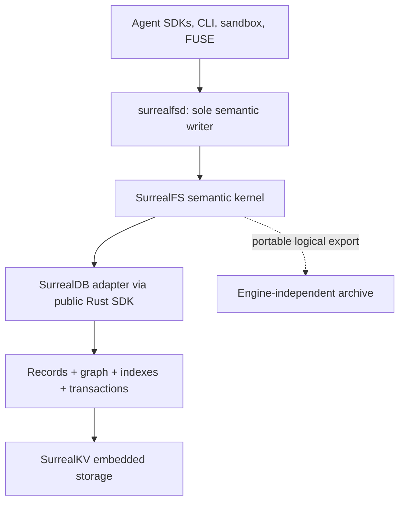
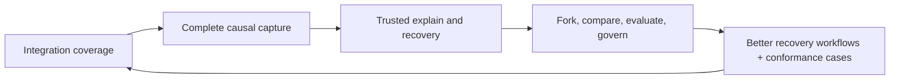
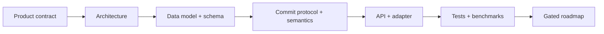

# SurrealFS

SurrealFS is a proposed causal execution workspace for AI agents. It combines versioned filesystem
and agent key-value state with tool provenance, artifacts, evaluations, policy decisions, snapshots,
and forks. The preferred proof implementation is embedded SurrealDB backed by SurrealKV; production
use of that engine remains conditional on Phase 0 evidence.

The working thesis is simple:

> The defensible product is not a database-backed filesystem. It is a causal, forkable execution
> substrate that can explain, reproduce, compare, recover, and govern agent work.

This repository is a documentation-first architecture and implementation plan. It intentionally
contains no production implementation yet.

## Start here

Choose one path; you do not need to read every Markdown file:

| If you are… | Read this |
|---|---|
| Deciding whether the team should build it | [Team pitch](PITCH.md) → [executive decision](docs/00-executive-decision.md) |
| Implementing the vertical slice | [Documentation guide: core implementation](docs/README.md#2-core-implementation--engineering-sequence) |
| Reviewing the database choice | [Documentation guide: storage-engine review](docs/README.md#3-storage-engine-review--focused-audit) |
| Looking for one specific design answer | [Canonical design index](docs/README.md#canonical-source-for-each-design-question) |

The [complete documentation guide](docs/README.md) explains how the design fits together and lists
all reference documents by purpose.

## Preferred proof architecture

Within the preferred adapter, SurrealDB and SurrealKV form one canonical local store. SurrealDB is
not a secondary projection, and SurrealKV is not exposed as a second persistence format. Filesystem
state, KV state, execution records, graph edges, and branch heads are committed through the same
semantic kernel. Phase 0 exercises the same thin causal-commit protocol against SQLite/AgentFS so
this choice is evidence-driven rather than assumed.

## What is and is not the moat

SurrealFS has no moat today. SurrealDB and SurrealKV are enabling infrastructure, not a future moat.
Defensibility can form only from the compound system:

1. Complete causal attribution from agent actions to state changes.
2. Instant, storage-efficient snapshots and forks of agent environments.
3. Filesystem-aware diffs and controlled merges.
4. Artifact provenance and dependency tracking.
5. Evaluation, recovery, and policy workflows that operate on the execution graph.
6. A consistent semantic kernel across filesystems, sandboxes, SDKs, and agent frameworks.
7. Portable evidence aligned with OpenTelemetry and open provenance standards.

See [The moat](docs/01-moat.md) for the full defensibility thesis and its falsification criteria.

## Is this worth building?

**A bounded proof is worth building; a full filesystem rewrite is not yet justified.** The database
combination makes the design cleaner, but it does not establish demand. The investment becomes
worthwhile only if SurrealFS makes at least one expensive workflow—failed-run recovery,
fork-and-compare evaluation, or artifact chain of custody—materially better than Git, tracing, and
ordinary sandbox snapshots used together.

The implementation is deliberately gated:

1. Prove immutable roots, transactional workspaces, enforced attribution, atomic state + provenance,
   crash recovery, export/restore, engine fitness, and license fit.
2. Prove that real users repeatedly rely on a causal recovery or fork/evaluation workflow.
3. Expand filesystem compatibility and graph depth only after those two proofs.

Stop, narrow, or replace the storage adapter if either proof fails. The detailed decision gates are
in the [executive decision](docs/00-executive-decision.md), [roadmap](docs/13-roadmap.md), and
[risk register](docs/14-risk-register.md).

## Why not SurrealKV alone?

SurrealKV alone is a plausible future storage adapter, but exposing it now would make this project
own schema validation, secondary indexes, graph adjacency/traversal, query behavior, migrations,
and a second conformance matrix. Those costs do not improve the moat. SurrealFS therefore keeps a
domain storage interface for replaceability while proving SurrealDB + SurrealKV first. It ships that
adapter only if the engine and product gates pass.

## Where the implementation design lives

The pitch is only the presentation layer. The implementation remains specified in separate,
canonical contracts:

Start with the [implementation reading sequence](docs/README.md#2-core-implementation--engineering-sequence),
or jump to the [canonical source table](docs/README.md#canonical-source-for-each-design-question).

## Core design rules

- There is exactly one semantic writer: `surrealfsd`.
- A commit references an immutable filesystem/KV state root; materialized heads are disposable.
- A tool writes through a private transactional workspace and publishes only through an explicit
  expected-head commit.
- `CAPTURED` attribution requires a daemon-issued workspace capability and verified process scope;
  trace/span IDs alone are correlation metadata.
- A successful commit advances state and provenance atomically.
- Named snapshots point to application commits; they are not copied database directories.
- SurrealDB temporal versioning is optional operational support, not the source of branch truth.
- File chunks are immutable and content-addressed.
- Raw SurrealQL writes cannot mutate SurrealFS-owned records.
- Every persistent ID that may be retried is deterministic or supplied by the caller.
- The logical export format is independent of SurrealDB and SurrealKV physical formats.
- Historical claims are explicit. Imports never invent history that the source did not retain.
- Behavioral replay is best-effort unless external inputs, models, time, and randomness are pinned.

## Current status

The architecture is at the detailed-design stage. The engine choice was re-audited against current
private revision `e68539867` (`v3.3.0-nightly`, SurrealKV `0.21.3`). Current targeted upstream tests
pass for public-SDK transactions, session isolation, live queries, logical export/import, and
versioned operations; the shared SurrealKV adapter suite reports 73 passed, 0 failed, and 8 ignored.
This is dependency evidence, not SurrealFS production evidence.

The draft core schema was previously parsed and applied successfully to an in-memory instance; the
product query file parses, but no production implementation or semantic query fixture exists yet.
The next executable milestones are the dual-store conformance spike in Phase 0 and the Linux causal
workspace vertical slice in [Phase 1 of the roadmap](docs/13-roadmap.md): one private tool workspace,
filesystem and KV mutations, one immutable-root commit, enforced attribution, reopen recovery, fork,
and causal explanation.

## Licensing status

The intended license for SurrealFS is not yet selected. SurrealKV is Apache-2.0. SurrealDB's current
source license and any private/commercial agreement must be reviewed before distribution or a
hosted offering is committed to. See [engine and licensing risks](docs/08-surrealdb-surrealkv.md).
