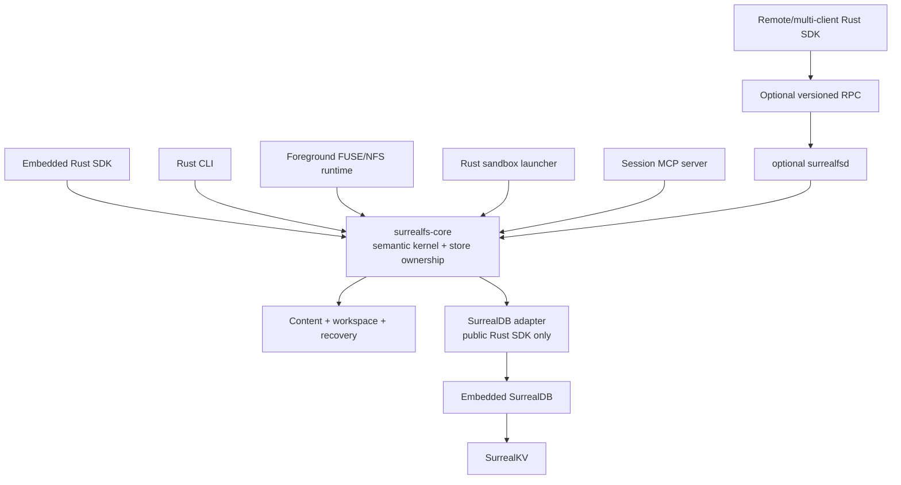

# SurrealFS implementation plan

Status: active
Last updated: 2026-08-07

## Objective

Build an agent filesystem with everything [agentfs.ai](https://www.agentfs.ai/) provides —
copy-on-write isolation, full auditability, portable sessions, the run/diff/approve loop,
snapshots and instant forking, SDK, CLI, MCP, and mounts — on embedded SurrealDB backed by
SurrealKV, and add one thing that data model makes possible and AgentFS structurally cannot
offer:

- **Provenance as a first-class query.** Which tool call produced this file version, what else
  did that run touch, what is the causal chain from an action to a byte. AgentFS's `tool_calls`
  table has no edge to its filesystem tables, and its shipped MCP, FUSE, and NFS paths never
  write it at all, so its audit log is usually empty.

That is the whole of the extension. SurrealDB is here because a graph over commits, mutations,
spans, and tool calls falls out of the data model for free — not as a licence to reach for its
other index types.

**Scope the claim carefully.** Versioning alone is not the differentiator: ContextFS
(`thustorage/ContextFS`) has commits, refs, branches, rollback, three-way merge, and GC, and its
cgroup-based per-agent routing is ahead of anything planned here. What it has no answer for is
the query — no database, no index, no reverse lookup, and per-commit rather than per-path
granularity, with the correlation listed as future work on its own roadmap. Against AgentFS and
`dofs` the versioning claim does hold, because neither has any. The defensible statement is
therefore *queryable action-to-byte provenance, explicit publication with expected-head, and one
transaction spanning files and KV* — not history-versus-none. See
[prior-art comparison](docs/17-prior-art-comparison.md). Full-text search, vector search, live queries, and SurrealQL-queryable KV
values were considered and **cut**: none had a use case that a simpler mechanism did not serve
better. See "Rejected extensions" below.

Rust is the only client SDK to start. TypeScript and Python arrive later as thin bindings over
`surrealfs-core`, never as a second implementation of the semantics. Remote sync is deferred.

### How agents actually use this

Agents write diffs; they do not need a mounted filesystem. agentfs.ai's own model is "run agents
unaware they're sandboxed, audit changes before committing to the real filesystem." So the SDK
and MCP path ships first and mounts come later, for the case where an unmodified CLI tool must
be confined without knowing it.

## Current status

Implemented and passing, 57 tests across unit, integration, crash, and reference-model suites:

| Crate | What it holds |
|---|---|
| `surrealfs-types` | Typed ids, `RepoPath`, errors, canonical encoding, BLAKE3 golden vectors |
| `surrealfs-content` | Fixed-size chunking, verification, and the persistent directory tree |
| `surrealfs-model` | Independent reference state machine used to cross-check roots |
| `surrealfs-store` | The only crate that talks to SurrealDB; migrations, publication, queries |
| `surrealfs-kernel` | Workspaces, filesystem/KV semantics, host ingest/apply, history |
| `surrealfs-core` | Exclusive store ownership and lifecycle |
| `surrealfs-sdk` | The public Rust SDK |
| `surrealfs-mcp` | MCP stdio server; every call is a recorded span |
| `surrealfs-cli` | `surrealfs` binary |
| `surrealfs-testkit` | Crash harness and fixtures |

Working end to end today: ingest a project, edit it through the SDK or MCP without touching the
real directory, diff, apply back with a drift check and backups, explain any path's causal
history, take savepoints, fork branches, and revert — the last three in constant time.

## Fixed decisions

1. **One language implementation:** all first-party product code is Rust. Shell scripts may install or
   run tests, but no product semantics live in another language.
2. **One public SDK:** only `surrealfs-sdk` is supported as a programmatic client.
3. **One store:** persistent state uses embedded SurrealDB with SurrealKV. There is no SQLite,
   AgentFS, raw-SurrealKV, or alternate production adapter.
4. **One store owner:** one process exclusively opens each embedded database directory. The owner may
   be an application using the embedded Rust SDK, a foreground mount/sandbox/MCP runtime, or optional
   `surrealfsd`. A process lock prevents a second owner.
5. **One semantic kernel:** filesystem, KV, workspace, commit, recovery, and attribution rules live
   once in Rust and are shared by every surface.
6. **Public SurrealDB boundary:** the store adapter may use the public SurrealDB Rust SDK with
   `kv-surrealkv`; it may not import internal engine, datastore, KVS, or SurrealKV crates. SurrealFS
   may change SurrealDB/SurrealKV upstream, but the product consumes those changes only through
   reviewed, supported public APIs on an immutable pin.
7. **Application history:** immutable SurrealFS commits and content-addressed roots define history.
   Engine temporal versioning is not the branch model.
8. **Behavioral parity is scoped:** match AgentFS user-visible behavior and error semantics, not its
   SQLite file format or internal implementation. Parity binds success-path behavior, error
   classification, path/name rules, and metadata fields. It never binds crash-atomicity, durability
   defaults, or resource-lifecycle defects: where the pinned baseline loses or corrupts state that
   SurrealFS preserves, the row is scored `STRONGER_WITH_DOCUMENTED_DIFFERENCE`, never a parity
   failure. Reproducing a baseline defect is out of scope by construction.
9. **Explicit publication:** filesystem callbacks stage private state. `close` and `fsync` never
   invent an application commit; a workspace publishes or aborts explicitly.
10. **No false rollback:** exact restoration applies to SurrealFS-controlled filesystem/KV state.
    External effects are reconciled, compensated, or left explicitly divergent.
11. **Upstream gaps are owned work:** configuration, lifecycle, error classification, and encryption
    gaps in the current SurrealDB/SurrealKV pin are scheduled upstream work, not reasons to add a
    second database. They remain release gates until their public APIs and failure tests pass.
12. **RPC is optional:** embedded calls and service calls use the same domain request/response types
    and semantic kernel. The initial proof contains no daemon or transport dependency.
13. **Capture claims are graded:** authoritative enforced, authoritative declared, transactional
    bridge, and observed evidence are never presented as equivalent.
14. **Selective Cloudflare reuse:** adopt content-object, bounded-staging, cache, migration, and
    observable-sync techniques only where they support SurrealFS invariants. Do not copy `dofs` live-
    state cursors, silent last-write-wins, Cloudflare-specific schema, or its TypeScript runtime.
15. **Reuse before invention:** prefer maintained Rust crates and audited, separable AgentFS code and
    conformance fixtures for generic filesystem, mount, sandbox, and CLI machinery. Port `dofs`
    invariants/tests rather than its TypeScript/SQLite implementation. New infrastructure code needs
    a documented incompatibility or safety reason.
16. **The engine is ours, not a constraint:** SurrealDB and SurrealKV are code this project owns
    and already modifies — `/Users/kfarhan/workspace/surrealdb/surrealkv` sits at the pinned
    0.21.3, alongside active branches for group commit, flush behaviour, and concurrency probes.
    A missing knob, a wrong default, or an untyped error is a patch we land locally (via
    `[patch.crates-io]`) and upstream, never a limit to design around. Treat an engine gap as
    scheduled work with an owner; never as a reason to add a second store or to weaken a
    guarantee. Fixed decision 11 says this about specific gaps — this says it about the engine.
17. **Publication and dependency evidence are independent:** publication capture grade never implies
    an exact POSIX read set. Receipts use `VERIFIED_OBJECTS`, `DECLARED_INPUTS`,
    `CONSERVATIVE_SCOPE`, or `UNKNOWN`; syscall/FUSE/NFS observations cannot become verified edges.
18. **Inode numbers are presentation, never identity:** they are allocated per mount, preserved
    across rename, never recycled, and never enter a commit. They do not survive a remount, so an
    NFS file handle derives from the path digest rather than the number. The adapter supplies the
    number explicitly in every reply — `fuser` is a low-level binding, so there is no `use_ino` to
    set and no layer that could substitute its own. See `docs/18-mount-semantics.md`.
19. **Timestamps derive from provenance, never from a stored clock:** `Meta` carries no times,
    because a clock in the state root breaks reproducibility and the reference-model cross-check.
    `mtime` is the commit time of the mutation that last wrote the path. `utimens` is accepted into
    process-lifetime state and does not persist; that is documented rather than silently ignored.
20. **Every buffer that can grow is bounded:** unpublished state is memory, and a mount never
    publishes on its own, so it is the workload that grows without limit. Both tiers are capped —
    per open file and per workspace — and the enforcement is tested, not just the constant.

## Pinned comparison baselines

### AgentFS

- Source: `/Users/kfarhan/workspace/projects/agentfs`
- Commit: `0a014ebd4918615baff589ed17486e557e7c6a23`
- Describe: `v0.6.4-2-g0a014eb`
- Rust crate: `agentfs-sdk 0.6.4`
- Schema specification: `0.4`

AgentFS is the complete compatibility baseline for:

- Rust SDK filesystem, KV, tool-call, overlay, host-filesystem, lifecycle, encryption, sync, and
  schema-version detection/gating behavior;
- CLI migration and administration workflows;
- CLI commands and output contracts;
- FUSE, NFS, mount, and temporary-exec workflows;
- Linux/macOS sandbox behavior;
- MCP filesystem/KV tools and resources;
- README/manual/CLI examples and operational ergonomics. The pinned `examples/` tree has no Rust
  SDK example, so M1b reproduces the documented README SDK flow rather than claiming parity with
  a pre-existing Rust example.

Verified baseline limits matter to the parity claim:

- `prune` supports mounts, not sessions;
- its sandbox uses namespaces and an optional ptrace mode, but no cgroup process scope;
- unlink at final link removal immediately deletes inode/data rather than preserving open-unlinked
  handles;
- migration apply/dry-run is a CLI workflow; the Rust SDK detects and gates schema versions;
- the Rust tool-call API supports get/recent/statistics but not a by-name call listing;
- MCP advertises `kv_list` but the pinned dispatcher does not implement it;
- macOS Seatbelt permits all reads and primarily confines writes;
- whole-database encryption exists through Turso 0.4.4, but is mutually exclusive with sync. The
  root cause is upstream: the Turso sync builder hardcodes `encryption: None`, so a synced database
  cannot be encrypted at rest regardless of caller configuration.

Further limits established by source review (see
[prior-art comparison](docs/17-prior-art-comparison.md)):

- **durability is off by default:** `PRAGMA synchronous = OFF` is set on every connection at open,
  and `fsync` is emulated by flipping to `FULL`, running an empty `BEGIN; COMMIT;`, and flipping
  back. Any performance comparison must state whether AgentFS was forced to `synchronous = FULL`;
- **most mutations are not transactional:** explicit transactions exist at only 8 call sites.
  `unlink`, `rmdir`, `link`, `mkdir`, `mknod`, `symlink`, `chmod`, `chown`, and `utimens` run in
  autocommit;
- **all access is serialized:** `ConnectionPool::MAX_CONNECTIONS = 1`, semaphore-gated with a 30 s
  timeout, so every call including reads queues on one connection. FUSE sets an infinite kernel
  cache TTL justified by "we are the only writer";
- **default chunk size is 4 KiB**, written to `fs_config` at init and immutable thereafter — two
  orders of magnitude below the 512 KiB used by Cloudflare `dofs`, and 64x below the SurrealFS v1
  choice. Benchmarks must sweep the whole range, not just the upper end;
- **the tool-call audit log is opt-in and usually empty:** the shipped MCP server, FUSE, NFS, and
  sandbox paths never write `tool_calls`. Records appear only when the embedding application calls
  `tools.record()` itself. The Rust SDK also `UPDATE`s existing rows, contrary to the spec clause
  that records "MUST NOT be updated or deleted";
- **NFS `COMMIT` (procedure 21) is unimplemented**, so `fsync` over the macOS NFS path is
  unavailable;
- **overlay copy-up is whole-file and eager**, and triggers even on a read-only `open`;
- **no extended attributes and no file locking** through FUSE — both return `ENOSYS`.

The published specification and the reference implementation disagree in several places:
`fs_whiteout` carries `parent_path` plus an index in `SPEC.md` and in the Go SDK but not in the Rust
SDK; `fs_overlay_config` and `tool_calls.status` exist in code but not in the specification; and
schema-version detection sniffs `PRAGMA table_info` rather than reading the
`fs_config['schema_version']` value AgentFS itself writes. The Go SDK is also built on
`modernc.org/sqlite` rather than Turso.

**Therefore: treat `SPEC.md` as intent and the pinned Rust source as truth.** Parity fixtures are
generated from observed Rust-SDK behavior, and each fixture records which SDK produced it. M3
import work must additionally tolerate both `fs_whiteout` shapes or declare Rust-SDK-only support
explicitly.

SurrealFS may deliberately exceed these limits. Such rows are labelled **extension**, not AgentFS
parity, so they cannot inflate the final compatibility score. Limits that are defects rather than
contracts are governed by fixed decision 8 and the table under "Semantic parity".

### TigerFS

- Source: `/Users/kfarhan/workspace/projects/tigerfs`
- Commit: `96d41a9fc6bef00739c4c93a3ce3913312f13bf5`
- Version: `v0.7.0`

TigerFS is a capability benchmark for the overlapping agent-workspace product:

- automatic history and structured operation log;
- savepoints and atomic undo;
- per-user/per-agent filtered recovery;
- FUSE/Linux and NFS/macOS parity;
- deterministic stress testing of history and rollback.

TigerFS history is opt-in per workspace/view, and history, operation-log, savepoint, and undo
workflows require TimescaleDB rather than plain PostgreSQL. The benchmark is the demonstrated user
outcome, not a claim that every PostgreSQL-mounted view has those capabilities.

TigerFS's PostgreSQL data-first filesystem, SQL pipeline directories, arbitrary Postgres mounting,
and DDL control surface are a separate product category and are not part of this plan.

### Cloudflare Computer / `@cloudflare/dofs`

- Source: `/Users/kfarhan/workspace/projects/cloudflare-computer`
- Commit: `cfa51ba15751ab01a78dbf745719c24e0bc82c45`
- Package: `packages/dofs` (`0.0.0`, private, preview-only)

Cloudflare is an engineering reference, not a parity target. Primary-source review confirms:

- AgentFS was evaluated but not adopted because its inline inode/chunk bytes do not support
  Cloudflare's hash-addressed object and manifest-sharing protocol;
- useful metadata vocabulary was reused without adding `agentfs-sdk` as a dependency;
- chunks/manifests, missing-object probes, short metadata transactions, per-backend watermarks,
  transaction-aware caches, migrations, FUSE buffering, and candid workload benchmarks are concrete
  techniques worth evaluating;
- live-state coalescing has no historical snapshot guarantee, and concurrent containers silently use
  last-write-wins;
- hardlinks are implemented correctly *locally* (refcount-gated reap, `nlink` derived from
  `vfs_dirents`); identity is lost only across the sync wire, where the coalescer emits one entry per
  name and the apply side calls `writeFile` per entry rather than `link`, so each name lands as an
  independent file;
- receive paths do not verify content identity at all — `stageBlob` documents that it trusts the
  caller, and its upsert overwrites existing payload bytes;
- manifests are not the transfer unit they are described as: change entries carry chunk lists read
  from `vfs_chunks`, and the buffered-write path sets `manifest_hash = NULL`, which disables the
  manifest fast path for any file last written through FUSE;
- the implementation is explicitly preview-only and its design docs contain forward-looking work.
  Its own published DDL has already drifted from the shipped schema, so read the source, not the
  specification.

A full source-level comparison of `dofs` and AgentFS, with the evidence behind these statements, is
in [prior-art comparison](docs/17-prior-art-comparison.md).

The adoption matrix in the architecture is normative. This plan does not claim feature parity with
Cloudflare Computer and does not add a Cloudflare deployment dependency.

### SurrealDB and SurrealKV

- Source: `/Users/kfarhan/workspace/surrealdb/surrealdb-private`
- Commit: `4bbf01ed90deafb4849f5b4a09df1a1d90c0d31f` (branch `arriqaaq/skv0213`; the previously
  pinned `e6853986…` was rebased away and survives only as an unreferenced object — tag an
  immutable revision before any external demo)
- Workspace version: `3.3.0-nightly`
- SurrealKV: `0.21.3`
- Required public feature: `kv-surrealkv`
- Initial durable profile: sync every acknowledged commit

Known facts at this pin:

- `3.3.0-nightly` is not published to crates.io and the pin is on a private personal branch;
- SurrealKV 0.21.3 has no complete at-rest encryption/key configuration;
- the public SDK has no awaited, error-reporting close/shutdown API; `Drop` uses a best-effort
  channel send and the embedded router currently discards datastore shutdown errors;
- the maximum memtable size *defaults* by system memory (64 MiB to 4 GiB, `kvs-surrealkv/src/cnf.rs`)
  — a default, not a ceiling, and settable per connection;
- SurrealKV tuning **is** reachable through the public SDK today, as connection query parameters:
  `surrealkv_block_size`, `surrealkv_block_cache_capacity`, `surrealkv_max_memtable_size`,
  `surrealkv_vlog_*`, `surrealkv_grouped_commit_*`. `opt/endpoint/mod.rs` splits the query string
  off before path cleaning specifically so it survives, `cnf.rs` documents the config as "parsed
  from query parameters", and `kvs-surrealkv/src/lib.rs` plumbs each one into `TreeBuilder`. An
  earlier revision of this document claimed the opposite; it was wrong.

These are upstream deliverables, not immutable constraints. Before the dependent SurrealFS phase
can exit, land a public typed SurrealKV configuration API, typed oversized-transaction/configuration
errors, awaited shutdown, and full-store encryption in SurrealDB/SurrealKV as specified below.

The exact dependency and configuration must be recorded in `Cargo.lock` and a compatibility
manifest. Moving the pin requires the revalidation checklist below.

### Engine-pin revalidation checklist

Run this checklist whenever the SurrealDB/SurrealKV pin, public feature set, or storage
configuration changes:

1. Record immutable source revision, source-content hash, Rust toolchain, enabled features, license,
   and effective SurrealKV configuration in the compatibility manifest.
2. Build through the public `surrealdb` SDK with `kv-surrealkv`; fail dependency checks if SurrealFS
   imports internal engine/datastore/KVS crates or hidden constructors.
3. Run public-SDK transaction, session-isolation, live-query, logical export/import, and versioned
   operation fixtures.
4. Run the shared SurrealKV adapter behavior suite and compare failures/ignored cases with the pinned
   baseline rather than accepting changed counts silently.
5. Verify typed configuration boundaries, effective-value inspection, exact transaction-size limit,
   and deterministic non-retryable oversized rejection.
6. Run concurrent expected-head/idempotency campaigns plus termination before/after commit, response
   loss, reopen, compaction, VLog rotation, and disk-full fault cases.
7. Prove awaited shutdown reports background/flush/close failures, releases the directory lock, and
   supports repeated reopen; acknowledged-commit safety must also survive process death.
8. Verify logical export plus content packs reconstruct every root and that the stopped-store physical
   recovery-copy procedure remains valid.
9. Re-run at-rest encryption coverage, key lifecycle, backup, compaction, crash-remnant, and offline
   inspection tests once encryption is enabled.
10. Publish raw results and separate the engine R&D decision from the SurrealFS product decision.
## Definitions of parity

### Surface parity

The equivalent SDK method, CLI command, mount operation, sandbox option, or MCP tool exists.

### Semantic parity

Success behavior, error classes, persistence, concurrency, and edge cases match the pinned AgentFS
behavior or a documented stronger contract.

Per fixed decision 8, semantic parity is bounded. The following baseline behaviors are **defects,
not contracts**, and SurrealFS deliberately does not reproduce them. Each is scored
`STRONGER_WITH_DOCUMENTED_DIFFERENCE` in the conformance manifest and needs no conformance case
asserting the baseline outcome:

| Pinned AgentFS behavior | SurrealFS position |
|---|---|
| `PRAGMA synchronous = OFF` on every connection; `fsync` emulated by a pragma flip plus empty `BEGIN; COMMIT;` | Acknowledge only durable commits |
| `unlink`, `rmdir`, `link`, `mkdir`, `mknod`, `symlink`, `chmod`, `chown`, `utimens` run in autocommit; `unlink` spans 5–6 independent transactions, so a crash mid-sequence leaves an orphaned inode or a dangling dentry, and `link` can leave a wrong `nlink` | Publication is atomic by construction |
| Open-unlinked handle reads return zero bytes (inode row deleted at `nlink = 0`, no open-handle refcount) | Correct open-unlinked lifecycle |
| NFS `COMMIT` (procedure 21) unimplemented, so `fsync` over the macOS NFS path is unavailable | Implement it |

A conformance case may still record the baseline behavior as an observation. It must not assert it
as required.

### Operational parity

Install, open, mount, execute, stop, migrate, sync, back up, recover, and diagnose workflows work
without implementation-team intervention.

### Complete parity

A feature is complete only when all three forms of parity have executable evidence. Matching a
method name or producing a successful demo is insufficient.
## Explicit non-scope

- TypeScript, Python, Go, browser, Cloudflare, serverless, and WASM SDKs;
- universal POSIX behavior beyond the documented compatibility matrix;
- exact semantic or byte-level read attribution for arbitrary POSIX subprocess trees;
- TigerFS data-first/PostgreSQL gateway behavior;
- a hosted multi-tenant control plane in the parity release;
- generic distributed transactions across arbitrary external providers;
- Windows mounts or a Windows security sandbox in the first parity release;
- a second storage backend if SurrealDB/SurrealKV fails.
## Target architecture



All surfaces call the same commands. FUSE and NFS translate mount operations; they do not own a
second filesystem implementation. A foreground mount process may own the store directly or connect
to the optional service. The sandbox launcher creates a capability-bound workspace and process
scope; it accesses state only through the shared kernel.

## Repository layout

Crates marked *planned* do not exist yet; the rest are implemented.

```text
Cargo.toml
crates/
  surrealfs-types/       Ids, paths, errors, canonical encoding, digests
  surrealfs-model/       Pure reference state machine used to cross-check roots
  surrealfs-content/     Chunking, verification, persistent directory tree
  surrealfs-store/       Public SurrealDB SDK adapter, migrations, queries
  surrealfs-kernel/      Workspaces, filesystem/KV semantics, host boundary, history
  surrealfs-core/        Embeddable composition, exclusive store ownership, lifecycle
  surrealfs-sdk/         The only public client-language SDK
  surrealfs-mcp/         MCP stdio server over the kernel
  surrealfs-cli/         CLI and administrative commands
  surrealfs-testkit/     Crash harness, fixtures
  surrealfs-fuse/        (planned, M4) Linux FUSE adapter
  surrealfs-nfs/         (planned, M4) NFSv3 adapter
  surrealfs-sandbox/     (planned, M4) Linux/macOS launch and process scope
examples/rust-sdk-basic/
schema/migrations/       0001-core, 0002-snapshots
```

Only `surrealfs-sdk` is a public language SDK. Internal crates may be published later, but they
are never separate implementations of the semantics.

A deliberate omission: there is no `surrealfs-protocol` or `surrealfsd`. Fixed decision 12 keeps
RPC optional, and nothing so far has needed a second process. They arrive if and when a real
requirement for multiple clients or remote access does.

## Product parity matrix

### Rust SDK and lifecycle

| Capability | SurrealFS outcome | Milestone |
|---|---|---:|
| Open/create by ID | embedded repository under `.surrealfs/<id>/` | M1b |
| Open by explicit path | validated exclusively locked repository directory | M1b |
| Ephemeral repository | in-process memory repository for tests/sessions | M1b |
| ID validation and resolution | compatible safe-name behavior | M1b |
| Cloneable handles | thread-safe Rust handle over one embedded core or service session | M1b |
| Filesystem/KV/tool handles | familiar `sfs.fs`, `sfs.kv`, `sfs.tools` facade | M1b |
| Graceful close | awaited embedded close; service drain/shutdown when service mode is enabled | M1b |
| Encryption options | validated complete at-rest claim and key handling | M5 |
| Migration | SDK version detection/gating; CLI dry-run/apply, manifest, diagnostics | M5 |
| Remote sync options | SurrealFS commit/content sync configuration | deferred |
| `push`, `pull`, checkpoint, stats | equivalent user outcomes, not Turso internals | deferred |

### Filesystem semantics

The shared Rust `File` and `FileSystem` traits cover:

| Area | Required operations | Milestone |
|---|---|---:|
| Open-file I/O | `pread`, `pwrite`, `truncate`, `fsync`, `fstat` | M1b |
| Lookup/metadata | `lookup`, `getattr`, `statfs`, `forget` | M1b |
| Directory reads | `readdir`, optimized `readdir_plus` | M1b |
| Metadata mutation | `chmod`, `chown`, `utimens` | M3 |
| Creation | `mkdir`, `create_file`, supported `mknod` types | M3 |
| Links | hard `link`, `symlink`, `readlink`, loop detection | M3 |
| Removal | `unlink`, `rmdir`; correct open-unlinked lifecycle is an extension | M3 |
| Rename | same/cross-directory, replace, subtree, atomicity rules | M3 |
| Path helpers | read/write/copy/rename/rm/access/stat/lstat | M1b |
| Metadata | mode, link count, UID/GID, size, nanosecond times, `rdev` | M3 |
| Error mapping | documented errno-equivalent typed errors | M1b |
| Content edges | empty/binary/multi-chunk, offset writes, grow/shrink, holes | M3 |
| Path edges | root, dot components, special bytes, long names, symlink loops | M3 |

Sockets, live device semantics, mandatory file locks, `mmap` coherence, and every platform xattr are
not implied unless explicitly added to the supported subset.

### KV and tool calls

| Capability | Required behavior | Milestone |
|---|---|---:|
| KV set/get/delete/keys/prefix list | typed serialization, deterministic order/pagination | M1b |
| File + KV atomicity | one workspace publication and state root | M1b |
| Tool start/success/error/record | compatible facade over action/span records | M1b |
| Tool get/recent | stable ordering and typed results (AgentFS parity) | M1b |
| Tool calls by name | stable typed listing (SurrealFS extension) | M2 |
| Tool statistics | counts, failures, duration aggregates | M2 |
| Pending after crash | interrupted/unknown, never fabricated success/failure | M2 |
| Runs, nesting, retry links | SurrealFS extension | M2 |

### Overlay and host filesystem

| Capability | Required behavior | Milestone |
|---|---|---:|
| Linux/macOS HostFs | confined host-root implementation of shared traits | M3 |
| Overlay read | upper first, whiteout, then lower fallback | M3 |
| Copy-up | preserve bytes/metadata once on first mutation | M3 |
| Whiteouts | survive reopen and hide lower entries | M3 |
| Origin mapping | stable lower-to-upper inode relation | M3 |
| Merged listing | deterministic union with correct overrides | M3 |
| Overlay diff | added/modified/deleted paths and hashes | M2 |

### Embedded lifecycle and optional service protocol

| Capability | Required behavior | Milestone |
|---|---|---:|
| Exclusive store ownership | one embedding/runtime process per repository/store root | M1b |
| Embedded lifecycle | open, health, awaited close, lock release, reopen | M1b |
| Protocol negotiation | optional service version/capability/limit negotiation | M4 |
| Authentication | embedded caller trust or service peer credentials plus scoped capability | M1b |
| Idempotent commands | request ID and stored receipt | M1 |
| Streaming | in-process streams first; bounded RPC streams in service mode | M1b |
| Backpressure/deadlines | resource limits, cancellation, typed errors | M4 |
| Service lifecycle | readiness, health, drain, shutdown, reopen when `surrealfsd` is enabled | M4 |
| Durable subscription | sequence catch-up plus optional live-query wakeup | M2 |

### FUSE, NFS, and execution

| AgentFS capability | SurrealFS target | Milestone |
|---|---|---:|
| Linux FUSE mount | foreground Rust adapter backed by the shared kernel; optional RPC mode | M4 |
| macOS NFS mount | Rust NFSv3 server and mount lifecycle | M4 |
| NFS network serve | configurable bind/port and permissions | M4 |
| Mount listing | authoritative live mount/session view | M4 |
| Foreground/supervised mount | clean readiness and error propagation; no machine-wide daemon required | M4 |
| UID/GID and root/other access options | documented permission behavior | M4 |
| Temporary `exec` mount | mount, run, quiesce, publish/abort, unmount | M4 |
| FUSE/NFS conformance | same logical outcomes through both adapters | M4 |

### Sandbox

| Capability | Required behavior | Milestone |
|---|---|---:|
| Linux namespace sandbox | user/mount namespaces, read-only lower, private upper | M4 |
| Linux process scope | cgroup/process-tree identity and no detached writer (extension) | M4 |
| Linux ptrace mode | optional enforcement/debug parity only; never an exact dependency source | M4 |
| macOS sandbox | Seatbelt write confinement plus NFS/overlay; reads remain allowed at parity | M4 |
| Allowed host paths | explicit allowlist and no-default-allows mode | M4 |
| Named sessions | persistent delta/workspace across runs | M4 |
| Process listing | live session/process information | M4 |
| Prune mounts | safe cleanup of stale mounts after confirmation (AgentFS parity) | M4 |
| Prune sessions | safe cleanup after confirmation (SurrealFS extension) | M4 |
| Capture grade | `AUTHORITATIVE_ENFORCED`, `AUTHORITATIVE_DECLARED`, `TRANSACTIONAL_BRIDGE`, or `OBSERVED` | M1b/M4 |
| Dependency basis | `VERIFIED_OBJECTS`, `DECLARED_INPUTS`, `CONSERVATIVE_SCOPE`, or `UNKNOWN`; independent of capture grade | 2/6/8/11 |

### CLI and MCP

The Rust CLI must provide equivalent workflows for:

```text
surrealfs init
surrealfs fs ls|cat|write
surrealfs diff
surrealfs timeline
surrealfs mount
surrealfs exec
surrealfs run
surrealfs serve nfs
surrealfs serve mcp
surrealfs sync pull|push|stats|checkpoint
surrealfs migrate --dry-run
surrealfs ps
surrealfs prune mounts
surrealfs prune sessions  # SurrealFS extension
surrealfs completions install|uninstall|show
```

The MCP server exposes filtered filesystem and KV tools plus resources through stdio JSON-RPC. It
uses the Rust SDK and records tool/action context; it cannot write database tables directly. Every
advertised tool must have a dispatch/conformance test. A working `kv_list` is an extension/fix over
the pinned AgentFS MCP server, which advertises that tool without dispatching it.

### SurrealFS additions and TigerFS-overlap

| Capability | Required outcome | Milestone |
|---|---|---:|
| Immutable state roots | exact filesystem/KV identity | M1a |
| Private workspaces | staged changes invisible until publish | M1b |
| Branches/snapshots | constant-time references to roots | M2 |
| Structured operation log | action/commit/mutation history | M2 |
| Savepoints | named immutable commit references | M2 |
| Exact fork/restore | new branch at a verified root | M2 |
| Atomic undo | new compensating/recovery commit, old history retained | M2 |
| Per-agent selective recovery | allowed only with sufficient attribution/dependencies | M2 |
| File/KV/provenance diff | root-to-root comparison | M2 |
| Explain target | target -> commit -> action -> run | M2 |
| External-effect ledger | intent, attempts, evidence, resolution | later |
| Reconciliation/compensation | capability-aware combined recovery | later |
## SurrealDB-native persistence model

### Content and roots

- file content uses immutable BLAKE3-addressed chunks and extent manifests;
- the current implementation uses fixed 256 KiB chunks; M5 benchmarks validate rather than
  silently replaces that choice, and an incompatible strategy requires an explicit format-version
  transition plus migration/interoperability tests;
- hashes cover uncompressed bytes and every local/import/sync/restore boundary recomputes them;
- canonical manifest and root encodings have cross-implementation golden vectors;
- namespace, inode, content, and KV maps use immutable persistent nodes;
- commits reference one combined state root and canonical mutation root;
- unchanged nodes/chunks are shared across commits and branches;
- materialized head indexes are disposable, root-keyed projections;
- mutable staging/GC bookkeeping cannot rewrite immutable chunk payloads; split payload from mutable
  metadata if the pinned SurrealDB engine rewrites combined records on metadata updates;
- reachability from all retained roots, holds, and staging leases—not eager reference counts or only
  current heads—is authoritative for GC.

### Workspace publication transaction

Chunk payloads are staged before publication using parameterized `.bind()` calls and immutable
content hashes. They are not interpolated into SurrealQL and never ride inside the branch-publication
transaction. Unreferenced staged chunks are logically invisible and reclaimed after a grace period.

One public SurrealDB client transaction must carry only bounded metadata and references, and must:

1. check the deterministic request receipt;
2. validate expected branch head, workspace capability, base root, status, and process scope;
3. verify required staged content, then insert immutable metadata nodes, mutations, commit, and
   causal relations;
4. advance the branch head;
5. store the request receipt and durable sequence;
6. mark the workspace published;
7. commit once.

After an ambiguous outcome, the store owner queries the receipt. It does not blindly retry.

Each release pins a public SurrealKV max-memtable setting plus a smaller SurrealFS publication
byte/key budget established by tests on the lowest supported memory class. Requests over the
product budget fail before the engine transaction begins. An engine oversized-transaction failure
must be a typed, non-retryable error; it cannot be hidden as a generic transaction failure.

### Mount write semantics

FUSE/NFS callbacks modify only a private workspace. `close` and `fsync` make staged handle data
consistent and durable according to workspace policy, but do not publish a branch commit. Publication
occurs when the controlled command/workspace explicitly finishes, checkpoints, or is approved.

Per-handle buffering is permitted to reduce small-write amplification. Publish must quiesce writers,
flush all dirty handles, and verify the resulting workspace. Process-memory buffers are not described
as durable recovery; a stronger pre-publication journal is deferred until a measured workflow needs it.

### Cloudflare-derived implementation gates

| Gate | Earliest phase | Required result |
|---|---:|---|
| Public content/root/receipt encodings and golden vectors | 0 | Independent verifier produces identical IDs |
| Chunking and physical payload-layout benchmark | 0–1 | Validate fixed 256 KiB v1; keep combined records only if metadata updates do not rewrite payload bytes |
| Hash verification at every ingest boundary | 1–2 | Corrupt or mismatched objects never become reachable |
| Short publication transaction after idempotent staging | 1 | Large payload bytes stay outside branch publication |
| Fresh/upgrade schema equivalence and query-plan assertions | 1 and 9 | No missing index, constraint, or changed logical schema |
| Root/workspace-scoped transaction-safe caches | 2–4 | Rollback, rename, symlink, recovery, and parallel-root tests stay fresh |
| Kernel-level read-only/capability/path enforcement | 2–8 | Alternate surfaces and sync cannot bypass policy |
| Buffered mount writes separated from publication | 7 | Flush/close, crash, and publish failpoint corpus passes |
| Versioned immutable-object sync with applied-root acknowledgement | 10 | Resume and response loss converge without silent overwrite |
| Cloudflare-style real-workload benchmark comparison | Every beta gate | Regressions and unfavorable tradeoffs are published honestly |
## Milestones

Six in total. Effort is experienced engineer-weeks including code, tests, review, and docs.

### M1a — scalable roots ✅ done

The namespace is a persistent content-addressed tree: immutable directory nodes keyed by digest,
with unchanged subtrees shared between commits.

Delivered: `surrealfs_content::tree`, tree-backed state roots, incremental `write_state`, and the
removal of allocated inode identity (roots are pure path→content, so equal logical state always
yields an equal root).

Exit, met: editing one file in a 400-file repository persists at most three new state nodes,
asserted through the real store. Before this, every commit re-serialised the whole namespace.

### M1b — the agent diff loop ✅ done

Effort spent: ~1 week.

Delivered: project ingest with excludes; workspace edits over ingested state; root-to-root diff
that skips matching subtrees by digest; apply-to-host with a whole-change-set drift check and
backup manifest; the `surrealfs-mcp` server; CLI `init`/`diff`/`apply`/`explain`/`mcp`.

Exit, met: an MCP client edits a project, the real directory stays byte-identical until `apply`,
then matches exactly, and a graph query names the tool call responsible for any path.

### M2 — provenance and history ✅ done bar one item

**Done:** attribution by construction (every MCP call opens a span, and the commit it publishes
is linked to it, so a change cannot reach the repository unattributed); `explain <path>`
traversing mutation → commit → span → tool call; savepoints; branches and forking; revert as a
compensating commit that preserves the history it reverses. Fork and revert both store zero new
nodes regardless of repository size.

**Remaining:** tool-call statistics — counts, failure counts, and duration aggregates per tool.
The pinned AgentFS Rust API offers get/recent/statistics; we have the first two.

Estimate for the remainder: **under 1 engineer-week**.

### M3 — completeness: filesystem semantics and portability 🔶 mostly done

**Done:** rename (recorded as typed intent), copy, symlinks, metadata, open file handles with
positional I/O and correct open-unlinked lifecycle, hard links preserved through ingest and
apply, the portable session archive, and reachability-based garbage collection.

**Remaining:** errno mapping for the mount surfaces, overlay completion with lazy per-extent
copy-up, transaction-aware caches, and fresh-versus-upgraded migration equivalence tests. Most
of what is left exists to serve M4 rather than the SDK.

Effort remaining: **4–7 engineer-weeks**

Original scope, for reference — full filesystem semantics from the parity matrix: symlinks, hard links via an explicit
content-addressed link-group node, rename recorded as typed intent in the mutation log, metadata,
correct open-unlinked lifecycle, errno mapping. Overlay completion for the mount path with lazy
per-extent copy-up. A portable session archive with every root re-verified on import. Chunk and
node garbage collection by reachability, with a grace period. Transaction-aware caches and
fresh-versus-upgraded migration equivalence tests.

Note the root format does not change here: identity stays path-based, and hard links are a
separate structure rather than a return to allocated inode numbers.

### M4 — mounts and sandbox

Effort: **15–25 engineer-weeks**

**Done:** the protocol-agnostic mount layer (`surrealfs-mount`) — inode table, errno mapping,
POSIX attributes, file handles, and the semantics both adapters inherit, tested once rather than
twice against two wire formats. Both staging tiers are now bounded. The decisions behind it, and
the verified comparison against AgentFS, `dofs`, and ContextFS that settled them, are in
`docs/18-mount-semantics.md`.

**Done:** cross-surface conformance. One workload through the SDK, through MCP over JSON-RPC, and
through the mount layer produces one identical state root, with commit *counts* deliberately
differing — converging histories would mean a mount had started publishing on its own. A
companion test pins the sensitivity of the comparison itself, so an equality assertion that has
gone blind fails rather than passes. FUSE and NFS join the same test once they can be run.

**Done:** process confinement (`surrealfs-sandbox`) on macOS. A `Confinement` policy renders to a
Seatbelt profile as a pure function, and the enforcement is verified by spawning real processes:
writes land inside the mount, are refused outside it, and reads outside are denied. Confinement is
product surface rather than deployment detail — an agent that can write outside its mount has
escaped the provenance graph, not merely the filesystem. Linux namespace confinement returns an
error rather than an unconfined command, so the gap fails loudly.

**Done:** the FUSE adapter (`surrealfs-fuse`), verified against a real Linux kernel mount — POSIX
operations, inode stability across rename, symlinks and hard links, multi-chunk round trips, errno
fidelity, and that writing through the mount publishes nothing. `docker/linux-test.Dockerfile` and
`scripts/linux-test.sh` make that runnable from a Darwin host, so "needs a Linux box" is no longer
a reason for anything here to ship untested.

The adapter requests **`FUSE_ATOMIC_O_TRUNC`**, and that is load-bearing rather than tuning:
without it the kernel turns every `fs::write` to an existing file into `open` plus a separate
`setattr(size=0)`, which an adapter can only service by opening a second handle on a path it
already has open. Closing that handle trips the kernel's stale-handle protection and the caller's
write is discarded with no error. A real mount did exactly that before the capability was
requested; the constraint is now pinned by a test in `surrealfs-mount` that runs on any platform.

**Done:** `surrealfs run` (`surrealfs-run`). A command runs against a real directory, confined to
it, and everything it changed becomes one commit attributed to that run — so `explain <path>`
names the command that produced a byte, which is the claim this project is built on. Confinement
is on by default and an unconfined run says so in its report, because a commit from an unconfined
run is a record that may be silently incomplete. A run that changes nothing commits nothing.

That last property required fixing `host::ingest`, which rewrote every file it scanned whether or
not it had changed — so re-ingesting an unchanged tree recorded a mutation per file and published
a commit whose state root equalled its parent. Extents are content digests, so comparing them is
exact; the skip also makes re-ingesting a large tree O(changed) rather than O(tree).

**Platform limit that remains:** NFSv3 still needs a macOS host to exercise, and the Linux
namespace path is moot — confinement uses Landlock, which needs no privileges at all.

FUSE on Linux and NFSv3 on macOS over the same kernel, after a provenance and maintenance audit
of the vendored `fuser`/`nfsserve` code against maintained alternatives. NFS `COMMIT` gets
implemented — the baseline leaves it out, so `fsync` over its macOS path does nothing. Full
`surrealfs run`: overlay-mounted working directory, namespace or Seatbelt confinement, named
sessions, `ps`, prune. Cross-surface conformance: the same workload must produce the same root
through the SDK, MCP, FUSE, and NFS.

### M5 — operations and hardening

Effort: **10–16 engineer-weeks**

**Done:** content encryption (`surrealfs-store::cipher`). AES-256-GCM over chunk bodies, keyed by
`SURREALFS_KEY` or `--key`. File content and KV values are unreadable without the key; paths,
sizes, and commit messages stay in the clear, and that division is documented in
`docs/19-encryption.md` and pinned by a test rather than implied away. Proven by scanning the
actual database files for a canary — paired against a plaintext store asserting the canary *is*
found, so the scan cannot pass for the wrong reason.

The earlier position that at-rest encryption was "the one blocking upstream gap" was wrong and is
corrected. AgentFS's encryption is real but comes free from turso's pager: its own contribution is
a two-field struct and one builder branch, gated `experimental`, exposed on 4 of ~15 subcommands,
with the key visible in `ps` and un-redacted in `Debug`. The parity bar was far lower than the
marketing implied. Full-database encryption remains scheduled upstream work in SurrealKV — which
has no crypto at all today — not a release gate.

**Done:** time-level forking. One resolver handles commit ids, savepoint names, and `@`-prefixed
moments (`@2h`, `@2026-08-01T12:00:00Z`), so `branch create --at`, `savepoint create --at`,
`revert`, and `fs ls/cat --at` all gained time references from a single change. AgentFS's README
advertises WAL-based time-travel forking and its source contains none; this is that capability
made real, and forking a moment still copies nothing.

Two things that would have silently broken it, both now fixed and tested: archive import stamped
`time::now()` on every commit, relocating an entire history to the moment of import; and
`format_rfc3339` truncated to whole seconds, so a query at a commit's own instant landed before it
and missed it.

**Done:** migration inspection (`surrealfs migrate`, `--apply`) and shell completions
(`surrealfs completions <shell>`). Both run *before* the store is opened, because opening is what
applies migrations — an inspection that opened normally would only ever report success, and
asking for completions should not create a repository as a side effect. States distinguish
`pending` from `INTERRUPTED` and `CHANGED SINCE APPLIED`; the latter two are not fixed by running
the migration again, so the command says so rather than suggesting `--apply`.

Remaining M5 work: Migration dry-run and apply
commands. Benchmarks with the chunk-size sweep covering 4 KiB (AgentFS), 256 KiB (ours), and
512 KiB (`dofs`), durability-normalised against AgentFS's `synchronous = OFF` default. Crash and
soak campaigns. Reproducible packaging and an installer matching the `curl | bash` experience.
Shell completions.

### Later, recorded but not planned in detail

TypeScript and Python bindings over `surrealfs-core` via napi-rs and pyo3; browser support via
wasm and `kv-indxdb`; remote sync, deferred by decision. Content-addressed commits mean any
future remote is a SurrealDB peer rather than a bespoke protocol.

## Absorbed from the ContextFS review

Mechanisms worth taking, each with a milestone and a gate. None is scheduled yet; they are
recorded so the review is not lost and so nothing is built before its gate is met.

| # | Item | Engine exposure | Milestone | Gate |
|---|---|---|---:|---|
| 0 | **Resident state tier** — a bounded, process-lifetime, digest-keyed cache of tree nodes and chunks behind `NodeSource`, shared across workspaces and read-only views | none; sits above the SDK | M3 | Benchmark attributing cache and engine tuning separately |
| 1 | **Ambient per-agent routing** (cgroup v2 + routing fence for PID reuse and mid-operation migration) | none; lives in the mount adapter | M4 | Requires the concurrency change below; reuses the process-scope machinery `AUTHORITATIVE_ENFORCED` already needs |
| 2 | **Agent state journal** — session, execution, tool-call, filesystem-link records as first-class queryable records rather than opaque blobs | schema and graph only | M2/M3 | None; this is where we are structurally ahead |
| 3 | **Benchmark harness** — a do-nothing FUSE server as a floor, plus agent-simulation CSVs (checkpoint, rollback, branch-create, peak bytes) comparable against `agentfs`, `branchfs`, ContextFS | none | M3 | Gates items 0 and 5 |
| 4 | **Merge with conflict surfacing** | wide merges strain the publication budget | M3/M4 | Pairwise first; N-way needs a design decision. Surface base/ours/theirs and conflict *type*, not a bare path list |
| 5 | **Auto-checkpoint on a turn or tool-call boundary** | highest — each checkpoint is a real transaction under sync-per-commit | M4 | Blocked on 3. Do not state a granularity before it is measured. Identical-root turns are free by content addressing; coalescing and a weaker durability profile for auto-checkpoints are the other mitigations. An auto-checkpoint is a savepoint, never an approval — fixed decision 9 stands |
| 6 | **fanotify/eBPF `OBSERVED` evidence** | must never enter the commit path | M5 | Strict side channel: NDJSON stays canonical, only post-hoc summaries reach the database, graded `OBSERVED` and never a verified edge (decision 17). Linux-only |

**Concurrency consequence.** Item 1 requires several agents holding writable workspaces against
one mount, which the architecture currently rejects. The position to adopt is concurrent
writable workspaces **on distinct branches**, so routed agents never contend on one head, with
`expected_head` continuing to guard same-branch races. That is what makes item 4 necessary
rather than optional, and the two must land together.

## Rejected extensions

Considered and deliberately not built. Recorded with reasons so they are not re-proposed on the
grounds that the engine supports them — engine support is not a use case.

| Extension | Why not |
|---|---|
| Full-text search (BM25 over file content) | Relevance ranking answers the wrong question for code: an agent wants every occurrence with line numbers, not the top few by score. A prototype was written and reverted — it required a duplicate copy of every file plus a staleness tracker, which is exactly the "second system kept in sync" it was meant to avoid. `dofs` faced the same problem and shipped a `grep` primitive with no index at all. |
| Vector / semantic search | Embeddings would have to be caller-supplied, so the open questions are who computes them, on what schedule, and at what cost — with no demonstrated need. Agents already carry their own retrieval. |
| Live queries (`watch`) | Nothing subscribes. There is no UI, and polling the timeline is adequate for a CLI and an MCP server. Revisit only if a consumer appears that genuinely needs a stream. |
| SurrealQL-queryable KV values | No demonstrated need beyond the string get/set API that matches the baseline. |
| Cooperative process-memory snapshots | ContextFS ships these and documents the caveats honestly: not CRIU, requires the agent to link their runtime and call a boundary function, not crash-durable, descendants not memory-cloned, external sockets recorded as warnings rather than restored. Requiring the agent to link our runtime contradicts the unmodified-tools position, and the caveats reduce what is left to little. The agent-state journal is the honest version of the same ambition. |
| Windows mounts (WinFsp) | Out of scope for the first release, with a known cost rather than an impossibility. SurrealKV's own README marks Windows file operations as not thread safe — fixable upstream like any other engine gap, but unscheduled work on top of an absent Windows sandbox story. |
| AgentFS 0.4 importer | Not an AgentFS *feature* — a migration path, and one nobody has asked for. It would add a SQLite dependency to read a foreign database, could only be tested against synthetic fixtures (the pinned spec and its own Rust source disagree on `fs_whiteout`), and would import sessions whose `tool_calls` are empty anyway, since AgentFS's shipped mounts never write them. `surrealfs init <dir>` over files recovered with AgentFS's own tooling covers the realistic case with no new code. |

If content search inside an unmaterialised workspace is needed later, the answer is a `grep`
primitive — substring or regex, line numbers, optional path glob — which walks the tree and
scans chunks, requires no index, duplicates nothing, and can skip unchanged subtrees by digest.

## Upstream SurrealDB and SurrealKV work

These are gaps in the pinned engine that SurrealFS owns rather than works around. None currently
blocks the milestones above except encryption, which gates M5.

| Gap | Deliverable | Gates |
|---|---|---|
| Private nightly source | An accessible immutable tag or source archive | Any external demo |
| SurrealKV config is stringly-typed | A typed public config plus effective-value inspection. The knobs are already reachable as query parameters, so this is ergonomics and verifiability, not access. | Nothing — tuning is measurable today |
| Oversized transactions are generic errors | Typed, non-retryable size and configuration errors | Budget enforcement claims |
| No awaited public close | `shutdown().await -> Result` that drains, flushes, and reports | Clean lifecycle claims |
| No full-store encryption | SurrealKV encryption plus public key lifecycle | M5 |

Acknowledged-commit durability already holds without awaited shutdown; that API improves
operations, it is not a crash-safety substitute. The crash harness covers the difference.

## Testing program

### Model and property tests

- canonical encoding/root golden vectors;
- independent receipt/root/manifest/chunk verifier vectors, including empty, sparse, multi-chunk,
  malformed, wrong-hash, and decompression-boundary cases;
- path, inode, link, extent, workspace, and branch invariants;
- generated filesystem/KV sequences;
- overlay whiteout/copy-up model;
- recovery generated across all publication-grade/dependency-basis combinations, proving that weak
  evidence only broadens or refuses selective recovery;
- effect/recovery state machines and grade calculation.

### Store and crash tests

- migrations and reviewed SurrealQL on memory and SurrealKV, with fresh-versus-upgrade schema,
  constraint, index, and query-plan equivalence;
- concurrent expected-head campaigns;
- measured publication byte/key budget at every supported memory class, including exact-boundary and
  oversized rejection cases;
- process termination around chunk staging, database commit, result return, migrations, sync head
  movement, effect dispatch, and compensation;
- restart verification of roots, heads, receipts, chunks, effects, locks, and background errors;
- GC reachability from branches, historical commits, snapshots, recovery/export holds, and staging
  leases, plus safety-window races with active uploads;
- cache rollback/population, root isolation, negative lookup, symlink, rename, and recovery invalidation;
- SurrealKV compaction/SIGKILL regression campaign.

### Cross-surface conformance

Run the same logical workload through:

- embedded Rust SDK;
- service-connected Rust SDK when the optional service is enabled;
- CLI;
- FUSE;
- NFS;
- MCP;
- sandbox `exec/run`.

All must produce the same canonical mutations and state root where platform semantics permit.

### Security tests

- path traversal and symlink race escape;
- forged/expired/cross-repository capability;
- detached descendant and nested writer;
- page-cache/readahead, `mmap`, inherited-descriptor, allowed-host-path, and unmediated-network
  fixtures never produce verified dependency edges from POSIX observation;
- socket and repository-directory permissions;
- secret/log redaction;
- encryption offline inspection and key rotation;
- sync authentication/replay/tampering;
- caller-supplied object/hash mismatch and valid-length corrupt payloads at local, import, sync,
  restore, and repair boundaries;
- external credential/egress bypass and capture downgrade.

### Performance tests

Report p50/p95/p99, CPU, memory, disk, write amplification, and reopen time for:

- SDK and mounted metadata operations;
- 4 KiB, 1 MiB, 100 MiB, sparse, and repeated-content files;
- append, partial overwrite, prepend/insert, source-tree, package-install, and large sequential I/O,
  reporting dedup ratio and bytes rewritten/transferred rather than throughput alone;
- 1k, 10k, 100k directory entries;
- 1, 100, 1k, 10k mutations per publish;
- historical read, fork, diff, explain, and recovery;
- concurrent readers/writers and grouped durability;
- FUSE vs NFS cache behavior;
- sandbox launch/quiescence overhead;
- sync deduplication and resume;
- sync response loss, applied-root acknowledgement, mixed-version negotiation, concurrent-head
  conflict, and memory use for a file larger than the transfer batch budget.

AgentFS comparisons must normalize durability. A faster configuration that can lose acknowledged
work does not win.
## Stop or narrow criteria

Engineering conditions under which the design, not the ambition, is wrong. Each would mean the
SurrealDB-backed approach cannot deliver the guarantees claimed above, and the answer is to
change the design rather than add a second database.

- acknowledged commits fail crash, compaction, or reopen recovery;
- expected-head publication cannot be atomic through the public SurrealDB SDK;
- roots or logical exports cannot be independently verified;
- mounted hot paths structurally miss the agreed budget after measured indexing and batching work;
- the upstream encryption design cannot pass coverage, crash, key-lifecycle, or operational gates;
- licensing or the private dependency blocks distribution;
- process attribution cannot be enforced for the target sandbox.

## Definition of done

1. Every capability agentfs.ai advertises has an executable equivalent here, or a documented,
   deliberate difference.
2. Provenance answers "which tool call produced this state" for every surface that can mutate the
   repository, without the caller opting in.
3. Rust is the only client SDK, and every surface goes through the one semantic kernel.
4. Exactly one process owns each store directory.
5. Roots, branches, savepoints, forks, diffs, and reverts survive crash verification.
6. A session archive round-trips content, history, and provenance, and refuses anything that
   does not verify.
7. Encryption claims match their tested boundaries.
8. Security review and representative workload budgets pass.
9. Clean Linux and macOS installs run the documented demos.
