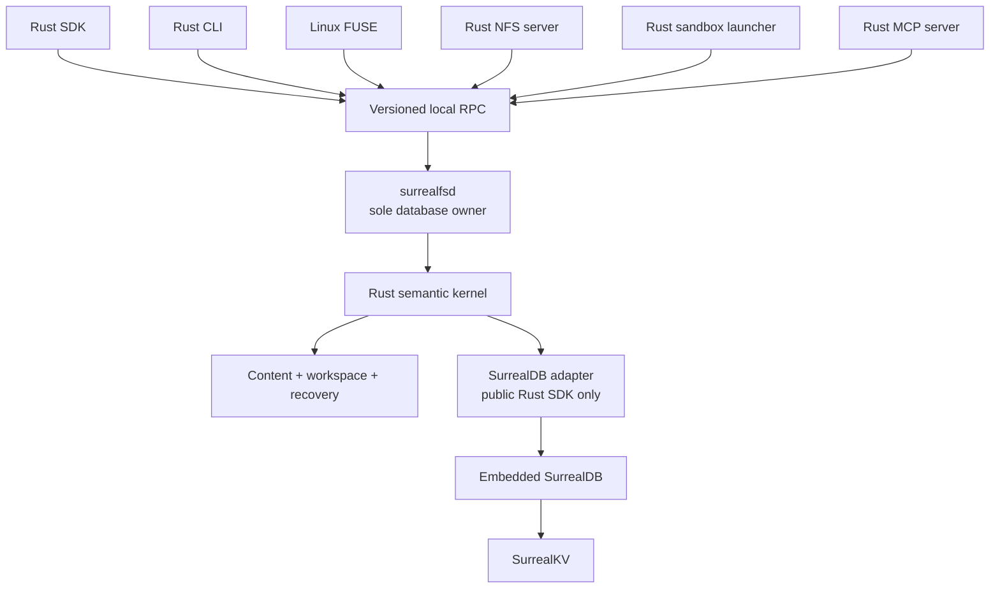

# SurrealFS full-Rust product plan

Status: active implementation plan  
Last updated: 2026-08-05

## Objective

Build a complete AgentFS-class product around embedded SurrealDB backed by SurrealKV, with every
product and runtime component implemented in Rust and one public Rust SDK.

The complete scope includes:

- the Rust SDK;
- `surrealfsd`, the sole database owner and semantic writer;
- the `surrealfs` CLI;
- Linux FUSE and macOS/userspace NFS mounts;
- host and copy-on-write overlay filesystems;
- Linux and macOS sandbox execution;
- filesystem, KV, tool-call, timeline, migration, encryption, sync, MCP, process, and administration
  surfaces comparable to AgentFS;
- SurrealFS-native immutable roots, workspaces, branches, snapshots, causal provenance, recovery, and
  external-effect reconciliation.

TypeScript, Python, Go, browser, and WASM SDKs are excluded. “Rust SDK only” means Rust is the only
client-language SDK, not that the daemon, mounts, sandbox, CLI, or product runtime are omitted.

## Fixed decisions

1. **One language implementation:** all first-party product code is Rust. Shell scripts may install or
   run tests, but no product semantics live in another language.
2. **One public SDK:** only `surrealfs-sdk` is supported as a programmatic client.
3. **One store:** persistent state uses embedded SurrealDB with SurrealKV. There is no SQLite,
   AgentFS, raw-SurrealKV, or alternate production adapter.
4. **One writer:** only `surrealfsd` opens the embedded database directory. The Rust SDK, CLI, mount
   adapters, sandbox launcher, and MCP server use the versioned local protocol.
5. **One semantic kernel:** filesystem, KV, workspace, commit, recovery, and attribution rules live
   once in Rust and are shared by every surface.
6. **Public SurrealDB boundary:** the store adapter may use the public SurrealDB Rust SDK with
   `kv-surrealkv`; it may not import internal engine, datastore, KVS, or SurrealKV crates. SurrealFS
   may change SurrealDB/SurrealKV upstream, but the product consumes those changes only through
   reviewed, supported public APIs on an immutable pin.
7. **Application history:** immutable SurrealFS commits and content-addressed roots define history.
   Engine temporal versioning is not the branch model.
8. **Behavioral parity:** match AgentFS user-visible behavior and error semantics, not its SQLite file
   format or internal implementation.
9. **Explicit publication:** filesystem callbacks stage private state. `close` and `fsync` never
   invent an application commit; a workspace publishes or aborts explicitly.
10. **No false rollback:** exact restoration applies to SurrealFS-controlled filesystem/KV state.
    External effects are reconciled, compensated, or left explicitly divergent.
11. **Upstream gaps are owned work:** configuration, lifecycle, error classification, and encryption
    gaps in the current SurrealDB/SurrealKV pin are scheduled upstream work, not reasons to add a
    second database. They remain release gates until their public APIs and failure tests pass.

## Pinned comparison baselines

### AgentFS

- Source: `/Users/kfarhan/workspace/projects/agentfs`
- Commit: `0a014ebd4918615baff589ed17486e557e7c6a23`
- Describe: `v0.6.4-2-g0a014eb`
- Rust crate: `agentfs-sdk 0.6.4`
- Schema specification: `0.4`

AgentFS is the complete compatibility baseline for:

- Rust SDK filesystem, KV, tool-call, overlay, host-filesystem, lifecycle, encryption, sync, and
  schema-version detection/gating behavior;
- CLI migration and administration workflows;
- CLI commands and output contracts;
- FUSE, NFS, mount, and temporary-exec workflows;
- Linux/macOS sandbox behavior;
- MCP filesystem/KV tools and resources;
- README/manual/CLI examples and operational ergonomics. The pinned `examples/` tree has no Rust
  SDK example, so Phase 2 reproduces the documented README SDK flow in Rust rather than claiming
  parity with a pre-existing Rust example.

Verified baseline limits matter to the parity claim:

- `prune` supports mounts, not sessions;
- its sandbox uses namespaces and an optional ptrace mode, but no cgroup process scope;
- unlink at final link removal immediately deletes inode/data rather than preserving open-unlinked
  handles;
- migration apply/dry-run is a CLI workflow; the Rust SDK detects and gates schema versions;
- the Rust tool-call API supports get/recent/statistics but not a by-name call listing;
- MCP advertises `kv_list` but the pinned dispatcher does not implement it;
- macOS Seatbelt permits all reads and primarily confines writes;
- whole-database encryption exists through Turso 0.4.4, but is mutually exclusive with sync.

SurrealFS may deliberately exceed these limits. Such rows are labelled **extension**, not AgentFS
parity, so they cannot inflate the Phase 13 compatibility score.

### TigerFS

- Source: `/Users/kfarhan/workspace/projects/tigerfs`
- Commit: `96d41a9fc6bef00739c4c93a3ce3913312f13bf5`
- Version: `v0.7.0`

TigerFS is a capability benchmark for the overlapping agent-workspace product:

- automatic history and structured operation log;
- savepoints and atomic undo;
- per-user/per-agent filtered recovery;
- FUSE/Linux and NFS/macOS parity;
- deterministic stress testing of history and rollback.

TigerFS history is opt-in per workspace/view, and history, operation-log, savepoint, and undo
workflows require TimescaleDB rather than plain PostgreSQL. The benchmark is the demonstrated user
outcome, not a claim that every PostgreSQL-mounted view has those capabilities.

TigerFS's PostgreSQL data-first filesystem, SQL pipeline directories, arbitrary Postgres mounting,
and DDL control surface are a separate product category and are not part of this plan.

### SurrealDB and SurrealKV

- Source: `/Users/kfarhan/workspace/surrealdb/surrealdb-private`
- Commit: `e68539867728aa6412a75c7669b0b33c30c00feb`
- Workspace version: `3.3.0-nightly`
- SurrealKV: `0.21.3`
- Required public feature: `kv-surrealkv`
- Initial durable profile: sync every acknowledged commit

Known facts at this pin:

- `3.3.0-nightly` is not published to crates.io and the pin is on a private personal branch;
- SurrealKV 0.21.3 has no complete at-rest encryption/key configuration;
- the public SDK has no awaited, error-reporting close/shutdown API; `Drop` uses a best-effort
  channel send and the embedded router currently discards datastore shutdown errors;
- maximum memtable size is machine-dependent (64 MiB to 4 GiB), and the SurrealKV-specific query
  parameter names are not reachable through the current public endpoint-prefix mapping.

These are upstream deliverables, not immutable constraints. Before the dependent SurrealFS phase
can exit, land a public typed SurrealKV configuration API, typed oversized-transaction/configuration
errors, awaited shutdown, and full-store encryption in SurrealDB/SurrealKV as specified below.

The exact dependency and configuration must be recorded in `Cargo.lock` and a compatibility
manifest. Moving the pin requires the revalidation checklist in
[the current source audit](docs/15-current-surrealdb-audit.md).

### Owned SurrealDB/SurrealKV upstream work

| Current gap | Upstream deliverable | Required by | Exit evidence |
|---|---|---:|---|
| Private nightly source | immutable accessible tag/revision or source archive | external Phase 2 demo | clean locked build and source-hash CI |
| SurrealKV config not fully reachable publicly | typed public config, correct routing, effective-config inspection | 1 | boundary/default/invalid-value tests on embedded SurrealKV |
| Oversized transaction is generic | typed non-retryable size/config errors | 1 | exact-boundary and over-boundary tests |
| No awaited public close | `shutdown().await -> Result` with drain/flush/close error propagation | 3 | failpoint, lock-release, and repeated-reopen tests |
| No complete store encryption | SurrealKV encryption plus public SurrealDB key/config lifecycle | 9 | offline artifact, rotation, backup, compaction, and crash matrix |

These changes can be implemented because the project controls or can contribute to both layers.
They are not reasons to introduce SQLite or raw SurrealKV into SurrealFS. They are still real work:
the relevant phase cannot exit until the change is public at the pinned boundary and its evidence is
part of the engine revalidation suite.

## Definitions of parity

### Surface parity

The equivalent SDK method, CLI command, mount operation, sandbox option, or MCP tool exists.

### Semantic parity

Success behavior, error classes, persistence, concurrency, and edge cases match the pinned AgentFS
behavior or a documented stronger contract.

### Operational parity

Install, open, mount, execute, stop, migrate, sync, back up, recover, and diagnose workflows work
without implementation-team intervention.

### Complete parity

A feature is complete only when all three forms of parity have executable evidence. Matching a
method name or producing a successful demo is insufficient.

## Explicit non-scope

- TypeScript, Python, Go, browser, Cloudflare, serverless, and WASM SDKs;
- universal POSIX behavior beyond the documented compatibility matrix;
- TigerFS data-first/PostgreSQL gateway behavior;
- a hosted multi-tenant control plane in the parity release;
- generic distributed transactions across arbitrary external providers;
- Windows mounts or a Windows security sandbox in the first parity release;
- a second storage backend if SurrealDB/SurrealKV fails.

## Target architecture



All surfaces call the same commands. FUSE and NFS translate protocol operations; they do not own a
second filesystem implementation. The sandbox launcher creates a capability-bound workspace and
process scope; it does not bypass the daemon with direct database access.

## Planned repository layout

```text
Cargo.toml
crates/
  surrealfs-types/       IDs, paths, values, receipts, errors, serialization
  surrealfs-model/       Pure reference state machine, roots, invariants, recovery
  surrealfs-content/     Chunking, manifests, staging, verification, GC
  surrealfs-store/       Public SurrealDB SDK adapter and migrations
  surrealfs-kernel/      Filesystem, KV, branch, action, workspace domain commands
  surrealfs-protocol/    Versioned local RPC messages and capability negotiation
  surrealfs-sdk/         The only public client-language SDK
  surrealfsd/            Store ownership, RPC server, lifecycle, policy, metrics
  surrealfs-cli/         CLI and administrative commands
  surrealfs-fuse/        Linux FUSE adapter
  surrealfs-nfs/         Rust NFSv3/userspace adapter
  surrealfs-sandbox/     Linux/macOS launch and process-scope enforcement
  surrealfs-mcp/         MCP stdio server over the Rust SDK
  surrealfs-sync/        Commit/content transport and remote reconciliation
  surrealfs-testkit/     Reference model, fake provider, failpoints, fixtures
examples/
  rust-sdk-basic/
  coding-agent-recovery/
schema/migrations/
tests/{model,conformance,crash,mount,sandbox,sync,recovery,workloads}/
```

Only `surrealfs-sdk` is a public language SDK. Internal crates may be published later if useful, but
they are not separate semantic implementations.

## Product parity matrix

### Rust SDK and lifecycle

| Capability | SurrealFS outcome | Phase |
|---|---|---:|
| Open/create by ID | repository under `.surrealfs/<id>/` through the daemon | 2 |
| Open by explicit path | validated daemon-owned repository directory | 2 |
| Ephemeral repository | daemon-hosted memory repository for tests/sessions | 2 |
| ID validation and resolution | compatible safe-name behavior | 2 |
| Cloneable handles | thread-safe Rust client over one daemon session | 2 |
| Filesystem/KV/tool handles | familiar `sfs.fs`, `sfs.kv`, `sfs.tools` facade | 2 |
| Graceful close | awaited client/session close plus observable daemon shutdown | 3 |
| Encryption options | validated complete at-rest claim and key handling | 9 |
| Migration | SDK version detection/gating; CLI dry-run/apply, manifest, diagnostics | 9 |
| Remote sync options | SurrealFS commit/content sync configuration | 10 |
| `push`, `pull`, checkpoint, stats | equivalent user outcomes, not Turso internals | 10 |

### Filesystem semantics

The shared Rust `File` and `FileSystem` traits cover:

| Area | Required operations | Phase |
|---|---|---:|
| Open-file I/O | `pread`, `pwrite`, `truncate`, `fsync`, `fstat` | 2–4 |
| Lookup/metadata | `lookup`, `getattr`, `statfs`, `forget` | 2–4 |
| Directory reads | `readdir`, optimized `readdir_plus` | 2–4 |
| Metadata mutation | `chmod`, `chown`, `utimens` | 4 |
| Creation | `mkdir`, `create_file`, supported `mknod` types | 4 |
| Links | hard `link`, `symlink`, `readlink`, loop detection | 4 |
| Removal | `unlink`, `rmdir`; correct open-unlinked lifecycle is an extension | 4 |
| Rename | same/cross-directory, replace, subtree, atomicity rules | 4 |
| Path helpers | read/write/copy/rename/rm/access/stat/lstat | 2–4 |
| Metadata | mode, link count, UID/GID, size, nanosecond times, `rdev` | 4 |
| Error mapping | documented errno-equivalent typed errors | 2–4 |
| Content edges | empty/binary/multi-chunk, offset writes, grow/shrink, holes | 4 |
| Path edges | root, dot components, special bytes, long names, symlink loops | 4 |

Sockets, live device semantics, mandatory file locks, `mmap` coherence, and every platform xattr are
not implied unless explicitly added to the supported subset.

### KV and tool calls

| Capability | Required behavior | Phase |
|---|---|---:|
| KV set/get/delete/keys/prefix list | typed serialization, deterministic order/pagination | 2 |
| File + KV atomicity | one workspace publication and state root | 2 |
| Tool start/success/error/record | compatible facade over action/span records | 2 |
| Tool get/recent | stable ordering and typed results (AgentFS parity) | 2 |
| Tool calls by name | stable typed listing (SurrealFS extension) | 6 |
| Tool statistics | counts, failures, duration aggregates | 6 |
| Pending after crash | interrupted/unknown, never fabricated success/failure | 6 |
| Runs, nesting, retry links | SurrealFS extension | 6 |

### Overlay and host filesystem

| Capability | Required behavior | Phase |
|---|---|---:|
| Linux/macOS HostFs | confined host-root implementation of shared traits | 5 |
| Overlay read | upper first, whiteout, then lower fallback | 5 |
| Copy-up | preserve bytes/metadata once on first mutation | 5 |
| Whiteouts | survive reopen and hide lower entries | 5 |
| Origin mapping | stable lower-to-upper inode relation | 5 |
| Merged listing | deterministic union with correct overrides | 5 |
| Overlay diff | added/modified/deleted paths and hashes | 5/11 |

### Daemon and local protocol

| Capability | Required behavior | Phase |
|---|---|---:|
| Exclusive store ownership | one daemon per repository/store root | 3 |
| Protocol negotiation | version/capability/limit negotiation | 3 |
| Authentication | peer credentials and scoped repository/workspace capability | 3 |
| Idempotent commands | request ID and stored receipt | 1–3 |
| Streaming | bounded file/export/import/timeline streams | 3 |
| Backpressure/deadlines | resource limits, cancellation, typed errors | 3/6 |
| Lifecycle | readiness, health, drain, shutdown, reopen | 3 |
| Durable subscription | sequence catch-up plus optional live-query wakeup | 6 |

### FUSE, NFS, and execution

| AgentFS capability | SurrealFS target | Phase |
|---|---|---:|
| Linux FUSE mount | Rust adapter backed by kernel RPC | 7 |
| macOS NFS mount | Rust NFSv3 server and mount lifecycle | 7 |
| NFS network serve | configurable bind/port and permissions | 7 |
| Mount listing | authoritative live mount/session view | 7 |
| Foreground/daemon mount | clean readiness and error propagation | 7 |
| UID/GID and root/other access options | documented permission behavior | 7 |
| Temporary `exec` mount | mount, run, quiesce, publish/abort, unmount | 7–8 |
| FUSE/NFS conformance | same logical outcomes through both adapters | 7 |

### Sandbox

| Capability | Required behavior | Phase |
|---|---|---:|
| Linux namespace sandbox | user/mount namespaces, read-only lower, private upper | 8 |
| Linux process scope | cgroup/process-tree identity and no detached writer (extension) | 8 |
| Linux ptrace mode | optional experimental syscall interception parity | 8 |
| macOS sandbox | Seatbelt write confinement plus NFS/overlay; reads remain allowed at parity | 8 |
| Allowed host paths | explicit allowlist and no-default-allows mode | 8 |
| Named sessions | persistent delta/workspace across runs | 8 |
| Process listing | live session/process information | 8 |
| Prune mounts | safe cleanup of stale mounts after confirmation (AgentFS parity) | 8 |
| Prune sessions | safe cleanup after confirmation (SurrealFS extension) | 8 |
| Capture grade | `ENFORCED`, `OBSERVED`, `DECLARED`, or `UNKNOWN` | 8/11 |

### CLI and MCP

The Rust CLI must provide equivalent workflows for:

```text
surrealfs init
surrealfs fs ls|cat|write
surrealfs diff
surrealfs timeline
surrealfs mount
surrealfs exec
surrealfs run
surrealfs serve nfs
surrealfs serve mcp
surrealfs sync pull|push|stats|checkpoint
surrealfs migrate --dry-run
surrealfs ps
surrealfs prune mounts
surrealfs prune sessions  # SurrealFS extension
surrealfs completions install|uninstall|show
```

The MCP server exposes filtered filesystem and KV tools plus resources through stdio JSON-RPC. It
uses the Rust SDK and records tool/action context; it cannot write database tables directly. Every
advertised tool must have a dispatch/conformance test. A working `kv_list` is an extension/fix over
the pinned AgentFS MCP server, which advertises that tool without dispatching it.

### SurrealFS additions and TigerFS-overlap

| Capability | Required outcome | Phase |
|---|---|---:|
| Immutable state roots | exact filesystem/KV identity | 2/11 |
| Private workspaces | staged changes invisible until publish | 2 |
| Branches/snapshots | constant-time references to roots | 11 |
| Structured operation log | action/commit/mutation history | 6/11 |
| Savepoints | named immutable commit references | 11 |
| Exact fork/restore | new branch at a verified root | 11 |
| Atomic undo | new compensating/recovery commit, old history retained | 11 |
| Per-agent selective recovery | allowed only with sufficient attribution/dependencies | 11 |
| File/KV/provenance diff | root-to-root comparison | 11 |
| Explain target | target -> commit -> action -> run | 11 |
| External-effect ledger | intent, attempts, evidence, resolution | 12 |
| Reconciliation/compensation | capability-aware combined recovery | 12 |

## SurrealDB-native persistence model

### Content and roots

- file content uses immutable BLAKE3-addressed chunks and extent manifests;
- namespace, inode, content, and KV maps use immutable persistent nodes;
- commits reference one combined state root and canonical mutation root;
- unchanged nodes/chunks are shared across commits and branches;
- materialized head indexes are disposable, root-keyed projections;
- reachability from retained roots, not eager reference counts, is authoritative for GC.

### Workspace publication transaction

Chunk payloads are staged before publication using parameterized `.bind()` calls and immutable
content hashes. They are not interpolated into SurrealQL and never ride inside the branch-publication
transaction. Unreferenced staged chunks are logically invisible and reclaimed after a grace period.

One public SurrealDB client transaction must carry only bounded metadata and references, and must:

1. check the deterministic request receipt;
2. validate expected branch head, workspace capability, base root, status, and process scope;
3. verify required staged content, then insert immutable metadata nodes, mutations, commit, and
   causal relations;
4. advance the branch head;
5. store the request receipt and durable sequence;
6. mark the workspace published;
7. commit once.

After an ambiguous outcome, the daemon queries the receipt. It does not blindly retry.

Each release pins a public SurrealKV max-memtable setting plus a smaller SurrealFS publication
byte/key budget established by Phase 1 tests on the lowest supported memory class. Requests over the
product budget fail before the engine transaction begins. An engine oversized-transaction failure
must be a typed, non-retryable error; it cannot be hidden as a generic transaction failure.

### Mount write semantics

FUSE/NFS callbacks modify only a private workspace. `close` and `fsync` make staged handle data
consistent and durable according to workspace policy, but do not publish a branch commit. Publication
occurs when the controlled command/workspace explicitly finishes, checkpoints, or is approved.

## Phased implementation

Effort is expressed in experienced engineer-weeks, including code, tests, review, and documentation.

### Phase 0 — bootstrap and pin

Effort: **2–4 engineer-weeks**

Deliver:

- Cargo workspace and crate boundaries;
- pinned Rust, SurrealDB, SurrealKV, and dependency lock;
- Linux/macOS CI for fmt, clippy, tests, dependency/license checks;
- typed IDs, paths, errors, canonical serialization, and hash golden vectors;
- compatibility manifest for engine/schema/protocol/export/root versions;
- executable engine-pin revalidation suite created from the manual checklist in
  `docs/15-current-surrealdb-audit.md`;
- durable dependency source: use the private immutable pin for authorized internal development,
  but publish/tag an accessible revision or immutable source archive before an external demo;
- upstream ADR and patch sequence for typed SurrealKV configuration, typed transaction-size errors,
  awaited shutdown, and full-store encryption/key handling;
- explicit encryption decision: upstream full-store encryption is the parity target; payload-only
  encryption and OS full-disk encryption may be documented fallback modes but are not whole-store
  application parity.

Exit:

- clean build uses no internal SurrealDB crate;
- dependency pin and effective engine configuration are observable;
- CI fails if the pinned source disappears or its content hash changes;
- the engine-pin checklist runs as a versioned command with machine-readable pass/fail output;
- upstream changes have owners, public API sketches, tests, and phase gates;
- pure model crate has no database dependency.

### Phase 1 — SurrealDB transaction proof

Effort: **3–6 engineer-weeks**

Deliver:

- minimal migrations for repository, branch, commit, root, receipt, action, workspace, chunk, file,
  KV, and relation records;
- explicit public-SDK transaction wrapper;
- expected-head compare-and-swap and deterministic receipt;
- public typed SurrealKV configuration for max memtable and effective-config inspection;
- typed oversized-transaction/configuration errors and a preflight publication byte/key budget;
- staged, hash-addressed chunk writes outside the bounded publication transaction;
- memory and SurrealKV test profiles;
- failpoints before commit, after apply, before response, and during reopen.

Exit:

- state, provenance, head, and receipt commit atomically;
- 100 randomized concurrent head campaigns produce one winner;
- same request returns same receipt; changed input is rejected;
- crash/reopen exposes the old or new complete transaction, never a mixture;
- ambiguous completion resolves by receipt lookup;
- large blobs use parameter binding, staged chunk payloads never enter the publication transaction,
  and over-budget publication is rejected deterministically before begin/commit.

### Phase 2 — Rust SDK vertical slice

Effort: **3–5 engineer-weeks**

Deliver:

- minimal daemon-hosted repository;
- Rust SDK connection and familiar `fs`, `kv`, `tools` facade;
- explicit/implicit workspaces;
- file write/read/list/stat/mkdir/unlink;
- KV set/get/delete/list;
- tool start/success/error/recent;
- atomic file + KV + action publication;
- immutable chunks, simple root, historical read, and reopen;
- Rust example reproducing the AgentFS README SDK flow.

Exit:

- unpublished changes are invisible and abort leaves no logical state;
- reopened bytes, KV, action, head, and root match;
- chunk corruption is detected;
- a clean environment with authorized access to the immutable pinned source can run the example with
  Cargo. An external demo additionally requires the public/tagged/archive dependency gate from
  Phase 0.

This is the first SDK demo, not complete product parity.

### Phase 3 — daemon and protocol foundation

Effort: **4–7 engineer-weeks**

Deliver:

- `surrealfsd` lifecycle, exclusive store lock, Unix socket, peer credentials;
- protocol negotiation, capabilities, limits, deadlines, cancellation, and errors;
- request receipt lookup and bounded streaming;
- repository/session/workspace capability enforcement;
- readiness, health, drain, shutdown, structured tracing, and metrics;
- upstream public `shutdown().await -> Result` support that drains background work, reports
  flush/close failures, and releases the directory lock;
- Rust SDK over protocol only; remove any temporary direct-store path.

Exit:

- only daemon process opens the store;
- forged/missing/expired capabilities fail closed;
- client timeout and reconnect preserve idempotency;
- awaited shutdown reports success/failure, releases locks, and permits repeated reopen. A bounded
  drop-all-handles/poll harness may validate the prototype before the upstream API lands, but cannot
  satisfy this exit criterion;
- large streams respect backpressure and cancellation.

Acknowledged-commit durability must already hold with `sync=every`; graceful shutdown is an
operational/lifecycle guarantee, not a substitute for crash durability.

### Phase 4 — complete filesystem semantics

Effort: **13–18 engineer-weeks**

Deliver all filesystem operations in the parity matrix, including open handles, offset I/O, extents,
hard links, symlinks, rename rules, correct open-unlinked behavior, metadata, errno mapping, and
optimized directory reads. Open-unlinked support is a SurrealFS correctness extension over the
pinned AgentFS behavior. Build a pure reference filesystem model and generated command campaigns.

Exit:

- every AgentFS Rust filesystem behavior has a passing SurrealFS conformance case or documented
  stronger difference;
- generated sequences match the reference model across publish, abort, reopen, and fork;
- no head read replays complete repository history;
- query plans and 1k/10k/100k-entry workloads meet prototype budgets.

### Phase 5 — HostFs and OverlayFs

Effort: **4–7 engineer-weeks**

Deliver Linux/macOS HostFs, confined resolution, copy-up, whiteouts, origins, merged listing, overlay
rename rules, persisted delta state, and diff inspection.

Exit:

- lower state is never mutated through the upper layer;
- path/symlink races cannot escape the configured lower root;
- copy-up and whiteouts survive restart;
- overlay behavior passes the AgentFS comparison suite on Linux and macOS.

### Phase 6 — execution graph and timeline

Effort: **3–5 engineer-weeks**

Deliver runs, nested spans, retries, action statistics, interrupted-state repair, durable event
sequences, timeline pagination, action-to-commit relations, resource limits, and explanation queries.

Exit:

- file/KV -> commit -> action -> run is one typed query;
- interrupted work is never fabricated as success/failure;
- timeline is stable under concurrent writes/reconnect;
- tool statistics match reference fixtures.

### Phase 7 — FUSE, NFS, mount, and exec

Effort: **8–13 engineer-weeks**

Deliver:

- provenance, maintenance, security, and API audit of the pinned AgentFS vendored `fuser` and
  `nfsserve` code; reuse/vendoring is allowed under its license when safer than a rewrite, while a
  maintained upstream crate is preferred when it meets the same tests;
- Linux FUSE adapter in Rust;
- Rust NFSv3 server for macOS/userspace use;
- persistent and foreground mount lifecycle;
- mount listing, UID/GID/access options, readiness, unmount, stale cleanup;
- temporary `exec` workflow;
- cross-adapter filesystem conformance and cache-invalidation tests.

Exit:

- the same workload produces the same logical roots through SDK, FUSE, and NFS;
- mount crash/restart has a documented recoverable path;
- NFS/FUSE caches do not make committed recovery silently stale;
- `exec` mounts, runs, quiesces, publishes/aborts, and unmounts without leaked resources.

This is the first complete AgentFS-like filesystem demo.

### Phase 8 — sandbox product

Effort: **7–12 engineer-weeks**

Deliver:

- Linux user/mount namespace sandbox with read-only lower and private overlay;
- cgroup/process-tree scope, descendant tracking, quiescence, and no detached writable child as a
  SurrealFS extension beyond the pinned AgentFS sandbox;
- named sessions and allowlisted host paths;
- optional ptrace interception mode and syscall trace; evaluate distribution risk before copying the
  AgentFS approach because its Reverie dependencies are pinned from Git rather than crates.io;
- macOS Seatbelt write-confinement profile plus NFS/overlay integration. Do not claim read
  confinement while the parity profile permits all reads;
- `run`, `ps`, session cleanup, and capture grading.

Exit:

- agent process tree cannot publish without its workspace capability;
- bypass, forged identity, nested writer, detached child, and escaped-path tests fail closed;
- permitted host paths behave exactly as documented;
- Linux/macOS demos preserve changes across named sessions;
- capture claims name the enforced boundary and downgrade when bypass remains possible.

### Phase 9 — CLI, MCP, migrations, encryption, and operations

Effort: **10–16 engineer-weeks**

Deliver:

- all CLI commands listed in the parity matrix;
- MCP stdio server with filtering, filesystem/KV tools, and resources;
- schema migration dry-run/apply and fixture upgrades;
- AgentFS 0.4 logical importer with honest imported provenance;
- engine-independent export/import with root verification;
- stopped-store physical recovery-copy workflow;
- upstream SurrealKV full-store encryption covering keys, values, metadata, indexes, WAL, value log,
  manifests, temporary/compaction files, physical recovery copies, and crash remnants;
- public SurrealDB encryption/key configuration, redacted diagnostics, rotation/rekey, wrong-key,
  interrupted-rekey, physical-copy restore, and crash-reopen behavior;
- encrypted-envelope option plus plaintext warning for logical exports, which are above the raw
  storage-encryption boundary;
- shell completions, diagnostics, verify, process/mount pruning.

The absence of complete store encryption at the current pin is a known fact, not a Phase 9 discovery.
Because SurrealDB/SurrealKV are modifiable, the primary plan is to implement it upstream and expose
it through supported public APIs. Payload-only encryption must disclose leaked paths, sizes, graph
shape, and other metadata, and cannot be called whole-store parity. OS full-disk encryption is a
deployment control, not an application encryption claim. AgentFS's own whole-database encryption is
mutually exclusive with its sync mode, so exact simultaneous encryption+sync behavior is a
SurrealFS stronger contract rather than baseline parity.

Exit:

- imported AgentFS bytes, paths, metadata, KV, overlay, and tool records match fixtures;
- logical export/import reproduces retained roots and graph counts;
- failed migration never leaves an unknown writable schema;
- offline inspection covers every listed store artifact, and key rotation/interruption tests
  validate the exact encryption claim;
- MCP and CLI call the same kernel paths as the SDK.

### Phase 10 — SurrealFS-native remote sync

Effort: **7–12 engineer-weeks**, plus remote service/infrastructure work

AgentFS sync uses the Turso 0.4.4 sync engine. Equivalent outcomes require a SurrealFS application
protocol:

- push/pull immutable commits, roots, chunks, receipts, and relations;
- content-addressed deduplication and resumable transport;
- remote expected-head compare-and-swap;
- explicit divergence branches/conflicts;
- checkpoint, compaction request, statistics, auth, quotas, and integrity verification;
- sparse/partial content fetch after full sync is correct.

Exit:

- offline repositories converge to verified roots;
- conflicting branch movement never silently overwrites history;
- interrupted transfer resumes without duplicate logical objects;
- corrupt/missing chunks prevent remote head acceptance;
- push/pull/checkpoint/stats provide documented AgentFS-equivalent outcomes.

Export/import alone is not sync parity.

### Phase 11 — history, forks, savepoints, undo, explain, and recovery

Effort: **6–10 engineer-weeks**

Deliver:

- immutable persistent roots suitable for constant-time branch/snapshot references;
- first-parent history and ancestry;
- named savepoints;
- root-based historical reads and file/KV/provenance diff;
- atomic undo as a new recorded commit;
- `ExplainTarget` queries;
- exact pre-action fork and alternate rerun;
- dependency capture levels and conservative per-agent/selective recovery;
- TigerFS-style history/undo stress fixtures.

Exit:

- fork/savepoint creation copies no complete state;
- root verification proves byte-for-byte restoration;
- undo preserves and can explain prior history;
- ancestry follows edges, not generation ranges;
- selective recovery is refused when dependency/attribution evidence is insufficient;
- a failed coding run can be forked before the harmful action, rerun, diffed, and selected.

### Phase 12 — external effects and combined recovery

Effort: **5–8 engineer-weeks**

Implement [the external-effects design](docs/16-external-effects-and-recovery.md):

- effect, attempt, resolution, evidence, and operation-capability records;
- durable intent before controlled dispatch;
- deterministic fake provider with response-loss failure windows;
- `UNKNOWN` reconciliation and no blind retry;
- provider-idempotent and marker/lookup adapter examples;
- compensation as a separate linked effect;
- combined local/external recovery plan and honest grades.

Exit:

- no controlled dispatch occurs without durable intent;
- provider apply followed by response loss becomes `UNKNOWN` and reconciles to `CONFIRMED`;
- restoring/forking local state never erases the external fact;
- compensation has its own success/failure/unknown outcome;
- demo reaches `LOCAL_EXACT_EXTERNAL_COMPENSATED` and also shows explicit divergence.

### Phase 13 — complete parity and beta hardening

Effort: **8–13 engineer-weeks**

Deliver:

- versioned conformance manifest mapping every actual AgentFS feature to a pinned source location and
  executable evidence, with SurrealFS extensions scored separately;
- SDK/CLI migration guide;
- SDK, FUSE, NFS, sandbox, sync, recovery, and crash workload benchmarks;
- compaction/reopen campaigns and 24–72 hour soak tests;
- security, dependency, license, and release review;
- reproducible Linux/macOS packages and installer;
- semver, MSRV, support matrix, API docs, and demo assets.

Exit:

- every parity row is `PASS`, `STRONGER_WITH_DOCUMENTED_DIFFERENCE`, or removed from the product
  claim;
- no known partial commit, wrong root, false attribution, bypass, or blind external retry remains;
- clean installs complete SDK, mount, sandbox, sync, and recovery demos;
- representative workloads meet agreed p95/p99, memory, disk, and startup budgets;
- release remains beta until repeated design-partner recovery use validates value.

## Demonstration sequence

### Demo 1 — AgentFS familiarity

1. `surrealfs init research-agent`.
2. Use the Rust SDK to write files, KV, and tool calls.
3. Use `surrealfs fs`, `timeline`, and `diff` to inspect them.
4. Restart the daemon and prove persistence/root verification.

### Demo 2 — mounted coding tool

1. Mount the repository through FUSE on Linux or NFS on macOS.
2. Run a normal shell/build tool with a private overlay.
3. Show the lower project unchanged before publication.
4. Publish one workspace commit and explain which action produced a path.
5. Repeat through `surrealfs exec` and `surrealfs run --session`.

### Demo 3 — exact recovery

1. Create savepoint/root `A`.
2. Run a harmful action that publishes root `B`.
3. Query timeline and explain the harmful file/KV changes.
4. Fork exact root `A` without copying the repository.
5. Run an alternative, compare roots/artifacts, and select the result.

### Demo 4 — external ambiguity

1. Durably prepare a fake deployment effect.
2. Provider applies it; response is intentionally lost.
3. SurrealFS records `UNKNOWN`.
4. Local recovery forks root `A` while preserving the effect fact.
5. Provider lookup confirms the deployment.
6. A linked compensation effect removes it.
7. Final grade is `LOCAL_EXACT_EXTERNAL_COMPENSATED`.
8. A fake irreversible email ends `LOCAL_EXACT_EXTERNAL_DIVERGED`.

The deterministic fake provider is required. A real provider cannot reliably reproduce every crash
window and is not a substitute for proof.

## Testing program

### Model and property tests

- canonical encoding/root golden vectors;
- path, inode, link, extent, workspace, and branch invariants;
- generated filesystem/KV sequences;
- overlay whiteout/copy-up model;
- effect/recovery state machines and grade calculation.

### Store and crash tests

- migrations and reviewed SurrealQL on memory and SurrealKV;
- concurrent expected-head campaigns;
- measured publication byte/key budget at every supported memory class, including exact-boundary and
  oversized rejection cases;
- process termination around chunk staging, database commit, result return, migrations, sync head
  movement, effect dispatch, and compensation;
- restart verification of roots, heads, receipts, chunks, effects, locks, and background errors;
- SurrealKV compaction/SIGKILL regression campaign.

### Cross-surface conformance

Run the same logical workload through:

- direct Rust SDK;
- CLI;
- FUSE;
- NFS;
- MCP;
- sandbox `exec/run`.

All must produce the same canonical mutations and state root where platform semantics permit.

### Security tests

- path traversal and symlink race escape;
- forged/expired/cross-repository capability;
- detached descendant and nested writer;
- socket and repository-directory permissions;
- secret/log redaction;
- encryption offline inspection and key rotation;
- sync authentication/replay/tampering;
- external credential/egress bypass and capture downgrade.

### Performance tests

Report p50/p95/p99, CPU, memory, disk, write amplification, and reopen time for:

- SDK and mounted metadata operations;
- 4 KiB, 1 MiB, 100 MiB, sparse, and repeated-content files;
- 1k, 10k, 100k directory entries;
- 1, 100, 1k, 10k mutations per publish;
- historical read, fork, diff, explain, and recovery;
- concurrent readers/writers and grouped durability;
- FUSE vs NFS cache behavior;
- sandbox launch/quiescence overhead;
- sync deduplication and resume.

AgentFS comparisons must normalize durability. A faster configuration that can lose acknowledged
work does not win.

## Engineering estimate

| Milestone | Engineer-weeks | Credible team/calendar |
|---|---:|---:|
| SDK transaction demo, Phases 0–2 | 8–15 | 2 engineers, 5–9 weeks |
| Daemon + filesystem + overlay + timeline, Phases 3–6 | 24–37 | 3 engineers, 3–6 months |
| FUSE/NFS + sandbox, Phases 7–8 | 15–25 | 2 runtime engineers, 2–4 months |
| CLI/MCP/ops/encryption/sync, Phases 9–10 | 17–28 | 2 engineers, 3–5 months |
| Recovery + effects, Phases 11–12 | 11–18 | 2 engineers, 1.5–3 months |
| Hardening, Phase 13 | 8–13 | full team, 1.5–3 months |
| **Complete full-Rust beta** | **83–136 total** | **4–5 engineers, roughly 9–17 months** |

A single senior engineer can produce the first SDK demo. Complete parity, two mount stacks, two
platform sandboxes, sync, and recovery are not a credible short solo project; sequentially this is
roughly 19–31 engineer-months at 4.33 weeks/month.

A rough source count of the pinned AgentFS Rust SDK/CLI/sandbox is about 42,200 lines, including
about 15,100 lines of vendored FUSE/NFS code. SurrealFS adds a daemon/protocol, immutable-history,
sync, upstream engine work, and external-effect recovery. Therefore the low bound assumes audited
reuse of mount components, tight scope, and no upstream surprises; completion below 90
engineer-weeks is an optimistic case, not the planning expectation.

## Team shape

- senior Rust/storage engineer: SurrealDB adapter, roots, transactions, migrations, durability;
- senior Rust/filesystem engineer: inode/content semantics, model, HostFs, OverlayFs;
- senior Rust/runtime engineer: daemon, protocol, FUSE, NFS, lifecycle;
- senior security/sandbox engineer: Linux/macOS sandbox, capabilities, path confinement;
- Rust product/DX engineer: SDK, CLI, MCP, sync, examples, installer;
- part-time security, database, and reliability review.

Fewer people can execute the same order with longer elapsed time. Adding people does not make the
correctness-critical filesystem model safely parallel without clear ownership.

## Principal risks

| Risk | Required response |
|---|---|
| SurrealDB hot-path overhead | query-plan and mounted-workload gates before claiming parity |
| Private/nightly dependency can disappear or be force-pushed | content hash now; public tag/revision or immutable accessible archive before external demo/beta |
| SurrealKV beta durability | deterministic crash/compaction/reopen and long soak campaigns |
| Public close lifecycle gap | implement upstream awaited, error-reporting shutdown; crash durability remains independent |
| Machine-dependent transaction ceiling | public typed max-memtable config/error, staged chunk payloads, measured publication budget, parameter binding |
| Current pin has no full-store encryption | implement it upstream and verify every artifact; fallback modes are disclosed and are not parity |
| Turso sync mismatch | application-level immutable commit/content sync protocol |
| FUSE/NFS semantic drift | one kernel and shared cross-surface conformance suite |
| Vendored mount/ptrace dependencies | provenance/security/maintenance audit; prefer maintained crates; mirror immutable Git-only dependencies if retained |
| Mount cache staleness | explicit invalidation, conservative cache settings, recovery tests |
| Sandbox escape/false capture | capability + process scope + negative tests + capture grade |
| Naive roots copy state | persistent immutable nodes and measured head projections |
| Selective undo corrupts dependencies | refuse without sufficient read/attribution evidence |
| External duplicates | intent first, operation manifests, `UNKNOWN`, no blind retry |
| Scope creep to other SDKs | enforce this plan's Rust-only language boundary |

## Stop or narrow criteria

Stop or narrow rather than adding another database if:

- acknowledged commits fail crash/compaction recovery;
- expected-head publication cannot be atomic through the public SurrealDB SDK;
- roots or logical exports cannot be independently verified;
- mounted hot paths structurally miss the agreed budget after measured indexing/batching work;
- the upstream full-store encryption design cannot pass coverage, crash, key-lifecycle, performance,
  or operational gates;
- SurrealDB licensing/private dependency blocks distribution;
- secure process attribution cannot be enforced for the target sandbox;
- users do not repeatedly use the recovery workflow after the complete demo.

Remote sync may be removed from the first release claim if no remote service is authorized. It may
not be marked complete because export/import exists.

## Definition of done

1. Every pinned AgentFS Rust product feature has executable parity evidence or a documented removal
   from the claim.
2. Rust is the only client SDK and all product components use the shared semantic kernel.
3. Only `surrealfsd` owns the embedded SurrealDB/SurrealKV store.
4. SDK, CLI, FUSE, NFS, MCP, and sandbox paths produce consistent state and provenance.
5. Exact roots, branches, savepoints, forks, diffs, and recovery pass crash verification.
6. AgentFS import preserves state and labels unknown provenance honestly.
7. Encryption and sync claims match their tested boundaries.
8. External ambiguity, reconciliation, compensation, and divergence are visible in the demo.
9. Security review and representative workload budgets pass.
10. Clean Linux and macOS installs run the documented parity and recovery demos.

Feature parity removes adoption objections; it is not the moat. The potential moat begins when users
repeatedly rely on exact state plus attribution plus external reconciliation to recover agent work.

## First implementation backlog

1. Bootstrap Cargo workspace and pin Rust/SurrealDB/SurrealKV.
2. Define canonical IDs, paths, hashes, errors, and compatibility manifest.
3. Open memory/SurrealKV through the public SDK in a minimal daemon.
4. Apply migration `0001` with checksum ledger.
5. Prove deterministic receipt and expected-head transaction.
6. Implement chunk staging, file manifest, and root golden fixture.
7. Implement workspace open/stage/publish/abort.
8. Implement basic file and KV operations in one commit.
9. Implement tool start/finish and caused relation.
10. Add child-process crash harness around commit.
11. Add Rust SDK example and CLI wrapper.
12. Record Phase 2 demo output before starting full filesystem semantics.
