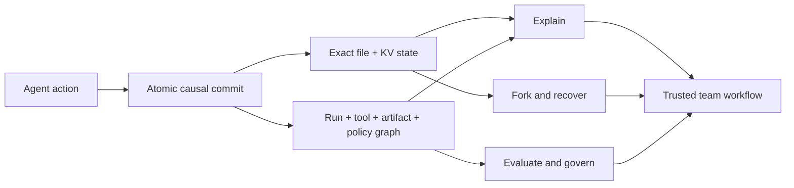
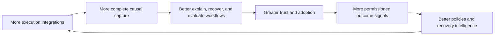

# The SurrealFS moat

## Thesis

SurrealFS should be defensible because it becomes the system of record for how agents transform
state—not because it stores files in SurrealKV or exposes SurrealQL.

The strongest positioning is:

> SurrealFS is the causal execution substrate for agents: every important action is linked to the
> exact state it observed, the state it produced, the artifacts it derived, the branch it changed,
> the policy that governed it, and the evaluation that judged it.

This creates a compounding advantage when capture, workflows, integrations, and outcome data reinforce
one another.

## The pitch in one diagram

The customer does not buy a graph or a storage engine. The customer buys confidence that an agent's
result can be explained, restored, compared, and governed from the exact state transition that
produced it.

The strategic sequence is:

1. own the mutation boundary;
2. make causality complete enough to trust;
3. turn trusted causality into repeated recovery, fork, evaluation, and policy workflows;
4. distribute through framework-neutral integrations;
5. use privacy-preserving outcome signals to make those workflows better.

Skipping the first two steps produces observability, not a defensible execution substrate.

## What is not a moat

The following can be copied or substituted and therefore cannot carry the strategy alone:

- SurrealDB;
- SurrealKV;
- a database-backed filesystem;
- a tool-call log;
- basic snapshots;
- a graph visualization;
- a wrapper around one agent SDK;
- benchmarks that show a faster local key-value engine;
- proprietary physical storage formats that merely trap data.

They may be useful capabilities. They become defensible only as parts of a product system that is
difficult to reproduce with equivalent correctness, coverage, data, and adoption.

## The five layers of defensibility

### 1. Causal correctness

Most observability systems correlate events after the fact using timestamps, names, and heuristics.
SurrealFS owns the state-transition boundary. It can atomically state that a particular tool span
caused a particular commit and that the commit introduced exact filesystem and KV mutations.

Correctness is difficult because it includes retries, crashes, open files, renames, links, nested tool
calls, streaming outputs, concurrent readers, and partial external failures. A history that is almost
correct is not trustworthy enough for recovery or governance. Years of semantic edge cases and
compatibility tests can become an engineering moat.

### 2. The agent execution ontology

The schema should encode durable concepts that remain meaningful across frameworks:

- agent identity and configuration;
- run and span hierarchy;
- tool invocation and result;
- observed and produced state;
- commits, snapshots, branches, and merges;
- artifacts and derivations;
- policies, decisions, exceptions, and approvals;
- evaluations, scores, failures, and baselines;
- external observations such as model, network, clock, and environment inputs.

The ontology becomes valuable when users can ask high-level questions without learning filesystem
internals or joining vendor-specific tracing tables.

### 3. Compound workflows

The moat should be measured in workflows that require several capabilities to work together:

- **Explain:** show the complete causal chain behind a path or artifact.
- **Rewind:** restore the state immediately before a harmful action.
- **Fork:** branch a live agent environment without copying it.
- **Compare:** identify the first state and causal divergence between two attempts.
- **Recover:** reuse known-good artifacts or roll back a failed span safely.
- **Evaluate:** compare agent strategies using exact inputs and state changes.
- **Govern:** enforce or review policy using attributable evidence.
- **Learn:** discover recurring failure patterns and effective recovery strategies.

A competitor can copy a table. Reproducing the whole workflow with trustworthy semantics is harder.

### 4. Integration coverage

SurrealFS gains defensibility by sitting below frameworks and above the local execution environment:

- FUSE/NFS/filesystem mounts;
- sandbox and process execution;
- Rust, TypeScript, Python, and Go SDKs;
- MCP and tool protocols;
- coding-agent and research-agent frameworks;
- local and CI execution;
- artifact export and hosted collaboration.

The kernel must stay framework-neutral. Integrations should translate framework events into one
canonical run/span/commit model rather than create parallel schemas.

### 5. Permissioned execution data

With explicit customer permission and strong isolation, aggregated execution data can improve:

- failure classification;
- automatic recovery suggestions;
- evaluation suites;
- policy defaults;
- performance tuning;
- detection of suspicious or wasteful behavior;
- estimates of which actions are likely to produce useful artifacts.

This is a potential data flywheel, not an automatic entitlement. Private source code, secrets, model
inputs, and customer artifacts must remain protected. Useful aggregate signals should be designed to
minimize collection and preserve tenant control.

## The flywheel

Every arrow must be validated. A trace corpus with incomplete causality or poor privacy controls can
create liability rather than a moat.

## Competitive boundary

| Capability | Git | Tracing | Snapshot | Graph database | SurrealFS target |
|---|---:|---:|---:|---:|---:|
| Exact file history | Strong | Weak | Point-in-time | Model-dependent | Strong |
| Runtime KV state | Weak | Observed only | Opaque | Model-dependent | Strong |
| Action-to-state atomicity | No | No | No | Not by itself | Core guarantee |
| Cheap semantic fork | Branches for files | No | Usually copy-on-write | No | Core workflow |
| Artifact/policy/evaluation graph | Weak | Partial | No | Strong query layer | Canonical domain model |
| Owns the mutation boundary | Partly, at commit | No | At snapshot only | No | Yes |

The competition is not “which database has graph traversal.” It is whether another product can
deliver equivalent capture correctness and recovery/evaluation ergonomics across the execution
surfaces customers actually use.

## Product surfaces that express the moat

### Local developer product

- inspect a run as a causal timeline;
- mount any commit or branch read-only;
- fork before retrying an agent;
- diff attempts by semantic action and artifact;
- export a self-contained evidence bundle;
- explain which action created or modified a file.

### Team product

- share runs and branches;
- review provenance and policy decisions;
- compare agents on the same captured starting state;
- retain signed evaluation evidence;
- search across runs, tools, artifacts, and failures;
- define organizational policies and approval points.

### Enterprise product

- tenant-controlled retention and encryption;
- compliance exports and tamper evidence;
- policy enforcement and exception workflows;
- private deployment and identity integration;
- fleet-wide evaluation and incident investigation;
- support for controlled data residency and redaction.

## Commercial wedge

The initial wedge should not be “replace your filesystem.” It should be one painful workflow where
causal state is indispensable. Strong candidates are:

1. debugging and recovering long-running coding-agent work;
2. evaluating multiple agents from identical project state;
3. proving artifact provenance in regulated or high-assurance workflows;
4. safely forking research or data agents before expensive actions;
5. tracing why an agent modified a repository or generated a deliverable.

The best wedge has frequent failures, expensive reruns, and clear value from exact state restoration.

## Moat metrics

Track metrics that indicate compounding product value:

- percentage of durable mutations with a known causal span;
- percentage of artifacts with complete derivation chains;
- median time to explain a failed output;
- recovery success rate using captured state;
- bytes and time avoided through forks and content deduplication;
- number of cross-framework workflows using the same ontology;
- evaluation reproducibility rate;
- policy decisions supported by direct evidence rather than timestamps;
- retention-adjusted growth of useful, permissioned execution patterns;
- user adoption of rewind, fork, compare, and explain—not only storage volume.

## Falsification criteria

The moat thesis is false or weak if:

- users only use SurrealFS as a file store;
- graph queries are confined to demos or dashboards;
- causal attribution regularly falls back to timestamp correlation;
- users do not trust restoration or provenance enough to make decisions;
- integrations require different semantics per framework;
- data cannot be used responsibly or does not improve product outcomes;
- switching costs come mainly from an opaque export format;
- a simple tracing database plus Git provides equivalent user value.

These are product research questions, not problems that storage-engine tuning can solve.

## Strategic role of SurrealDB and SurrealKV

SurrealDB accelerates the ontology and product-query layer. SurrealKV provides a local, embedded,
version-aware storage foundation. Their role is to reduce undifferentiated infrastructure work and
allow the team to spend engineering effort on causal capture and workflows.

If either dependency stops serving that purpose, the logical data model and domain protocol must make
replacement possible. Portability protects the moat by ensuring it belongs to SurrealFS rather than
to the physical engine.
