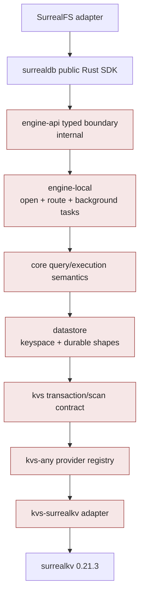
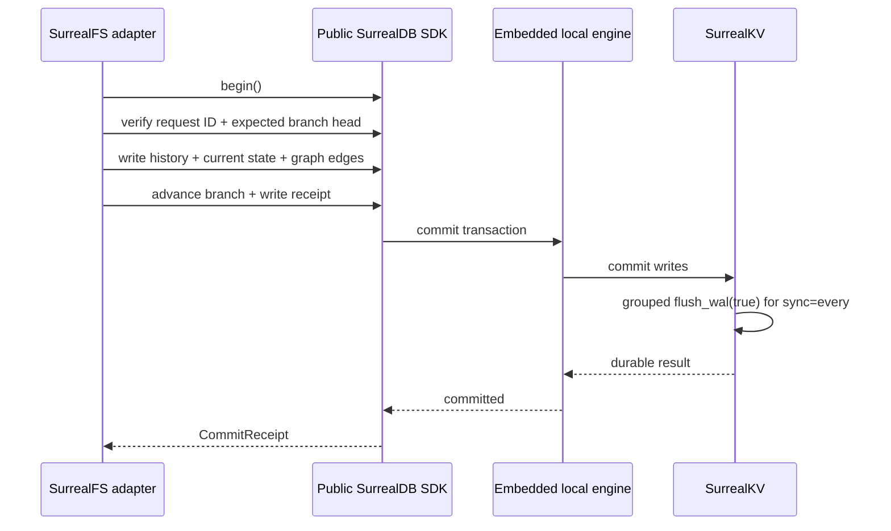

# Current private SurrealDB source audit

## Purpose and scope

This document records the exact local-source evidence used to revalidate the SurrealFS design after
the private SurrealDB tree changed. It is an architecture audit, not a production certification.

Audit date: `2026-08-04`

| Item | Audited value |
|---|---|
| Checkout | `/Users/kfarhan/workspace/surrealdb/surrealdb-private` |
| Branch | `arriqaaq/skv0213` tracking `origin/arriqaaq/skv0213` |
| HEAD | `e68539867728aa6412a75c7669b0b33c30c00feb` |
| Describe | `v3.0.0-beta.1-742-ge68539867` |
| Workspace crate version | `3.3.0-nightly` |
| SurrealKV dependency | `0.21.3` |
| Earlier plan baseline | `c94d6584ee4a1077b59ad119eb8f8ccea6c4d44a` |
| Change since baseline | 26 commits; 506 files; 43,258 insertions; 16,059 deletions |
| Pre-existing checkout status | untracked `AGENTS.md`; not modified by this audit |

The audit reviewed the public SDK path, embedded engine, transaction lifecycle, SurrealKV adapter,
configuration, durability coordination, shutdown, export/import, live queries, datastore migrations,
error classification, current tests, and dependency/stability boundaries.

## Executive finding

The current tree strengthens the case for a **conditional** SurrealDB + SurrealKV vertical slice.
The engine is more modular, the public SDK provides the transaction and embedded capabilities the
design needs, and startup migration handling is materially stronger.

It also clarifies what SurrealFS must not do:

- do not import internal engine, datastore, or KVS crates;
- do not use the hidden `unstable_from_datastore` constructor;
- do not treat live queries as a durable ordered event log;
- do not describe public SDK export as a SurrealKV physical snapshot;
- do not rely on graceful shutdown for acknowledged-commit correctness;
- do not blindly retry an unknown commit outcome.

The storage decision remains **proposed and gated**, not production-approved.

## Material architectural change

The earlier review saw a more tightly coupled SDK/core/storage layout. The current tree has extracted
responsibilities into explicit packages:



Relevant current packages include:

- `surrealdb/engine-api`: one typed interface used by engines;
- `surrealdb/engine-local`: opens the datastore, starts tasks, and services SDK routes;
- `surrealdb/datastore`: durable keyspace/value responsibilities extracted below core;
- `surrealdb/kvs`: backend-neutral transaction, scan, cursor, and error contracts;
- `surrealdb/kvs-any`: storage provider registry and configuration routing;
- `surrealdb/kvs-surrealkv`: first-party SurrealKV adapter;
- `surrealdb`: the application-facing Rust SDK.

This separation is useful internal engineering, but the internal packages explicitly state that
they carry no SemVer stability guarantee. The correct SurrealFS dependency remains:

```text
surrealfs-store-surreal -> surrealdb public SDK with kv-surrealkv
```

It must not become:

```text
surrealfs-store-surreal -> engine-local / datastore / kvs / kvs-surrealkv internals
```

The public feature mapping in `surrealdb/Cargo.toml` confirms that `kv-surrealkv` selects the local
engine and its SurrealKV backend. This is the supported construction path.

## Public transaction fit

The public SDK exposes `Surreal::begin()`. A transaction owns a session transaction ID and provides
query/create/select/update/delete operations followed by explicit `commit()` or `cancel()`. The
local router maps begin to a core write transaction and routes subsequent operations through the
same transaction/session.

That is the correct primitive for a SurrealFS semantic commit:



The adapter must still prove that its exact SurrealQL expected-head check conflicts correctly under
concurrency. The engine primitive exists; the SurrealFS invariant is not yet implemented.

### Error semantics relevant to retries

The internal KVS contract distinguishes:

- `TransactionConflict`: a retryable concurrency outcome;
- `CommitOutcomeUnknown`: the apply/acknowledgment outcome is uncertain and must not be retried
  blindly;
- `Shutdown`: can represent refusal before apply or a narrow apply-but-unconfirmed race depending on
  timing.

SurrealFS therefore needs deterministic request IDs and a receipt query. After a connection loss or
unknown result, it asks whether the request committed. It returns the stored outcome, retries only
when absence is proven, or reports `UNKNOWN` for explicit reconciliation.

## SurrealKV 0.21.3 and durability

Current root dependency: `surrealkv = "0.21.3"`.

The HEAD commit records two upstream fixes carried by this update:

1. fsync after compaction, addressing a SIGKILL scenario in which a manifest could reference a
   zero-byte SSTable and startup would fail;
2. a memtable-rotation bug fix.

No adapter code changed for the dependency update. This is positive evidence, but it also gives the
SurrealFS fault campaign a concrete regression scenario: kill during/after compaction and verify
reopen repeatedly.

### Current default profile

The current `SurrealKvConfig` defaults are:

| Setting | Current default | SurrealFS position |
|---|---:|---|
| Versioned storage | false | Keep off; application commits define history |
| Retention | zero | Not relied upon while versioning is off |
| Sync | every | Required durable starting profile |
| Value log | enabled | Benchmark for chunks and large metadata |
| Versioned index | false | Keep off initially |
| Block size | 64 KiB | Benchmark, then pin explicitly |
| Value-log threshold | 4 KiB | Benchmark 1/4/16/64 KiB |
| VLog max file | dynamic, 64–512 MiB | Pin per deployment after measurements |
| Block cache | dynamic from RAM, minimum 16 MiB | Replace with explicit product budget |
| Group timeout | 5 ms | Measure acknowledgment latency |
| Group wait threshold | 12 | Measure low/high concurrency behavior |
| Group max batch | 4096 | Bound and observe queue/memory |
| Max memtable | dynamic, 64 MiB–4 GiB | Pin; test oversized semantic commits |

Dynamic machine-relative defaults are reasonable engine defaults but unsuitable as an unnoticed
product contract. A SurrealFS release manifest should record the exact effective configuration.

At this pin, the public endpoint parser prefixes every query parameter with `datastore_`, while the
SurrealKV adapter expects its engine-specific controls under `surrealkv_*`. The public SDK also does
not expose a typed max-memtable builder. SurrealFS therefore cannot honestly claim that it has pinned
the effective maximum through the current public API. This is an owned upstream change: add a typed,
public SurrealKV configuration surface, correct the routing, expose effective configuration, and
test it before Phase 1 exits.

### Meaning of `sync=every`

The SurrealKV adapter commits transactions with `Durability::Eventual`, then uses a shared commit
coordinator to group waiters behind `flush_wal(true)`. Commit work can proceed in parallel and one
flush can durably acknowledge a group.

This means `sync=every` is compatible with a durable acknowledgment contract while still using
grouped fsync. It also means tests must cover coordinator shutdown, concurrent commit groups,
flush failures, and the boundary between database apply and client receipt.

`sync=<interval>` can lose recent acknowledged work on a system crash within the interval, and
`sync=never` relies on the operating system. Neither should back a v1 durable repository.

## At-rest encryption and dependency distribution

The audited SurrealKV 0.21.3 adapter exposes no full-store encryption or key-management path. This
is a known gap, not an unanswered Phase 9 discovery. Because SurrealDB and SurrealKV can be changed,
the product plan treats complete-store encryption as upstream work that must cover WAL, value log,
indexes, manifests, compaction/temporary artifacts, physical recovery copies, rotation, wrong-key
behavior, and crash recovery before claiming parity. Logical exports sit above raw storage
encryption and require a separate encrypted envelope or explicit plaintext warning. Payload-only
encryption and OS full-disk encryption may be useful deployment modes, but neither is a SurrealFS
whole-store encryption implementation.

The audited `3.3.0-nightly` crate is not published through the normal crates.io release channel, and
the exact commit is on a private personal branch. That is usable for authorized internal work only.
An external demo or beta requires an immutable accessible tag/revision or source archive with the
same compatibility-suite evidence; a branch name alone is not a durable dependency pin.

## Startup, migrations, and downgrade behavior

The current local engine performs these steps before reporting a successful connection:

1. build/open the datastore;
2. call `check_version()`;
3. run migration selection and the migration ledger;
4. call `bootstrap()`;
5. initialize credentials when configured;
6. start serving SDK routes and background tasks.

The current migration design records stable migration IDs, treats the ledger as the run-once gate,
requires migration work to be idempotent and safe under lease overlap, records a baseline for a new
store, and rejects a datastore with unknown applied migrations. A higher stored version without an
unknown migration warns rather than automatically failing.

This is a meaningful upgrade improvement. It covers SurrealDB-owned data layout. It does not replace
SurrealFS-owned schema migrations, export-version migrations, state-root verification, or cloned
upgrade drills.

## Live-query behavior

Embedded native mode advertises `LiveQueries`, and targeted public-SDK live-select testing passed.
The datastore supports inline and router-style live-query processing:

- inline processing performs matching/projection work on the mutation path;
- router processing stores change material and matches away from the foreground write path, with a
  finite retention window.

Neither mode is the SurrealFS durable event contract. Live notifications can wake a UI or reduce
polling. Durable subscriptions use a domain event sequence, catch-up query, event ID deduplication,
and persisted consumer cursor. Router mode should be benchmarked if dashboard subscribers materially
affect commit latency.

## Backup, export, and recovery

Embedded native mode advertises `Backup`, but the public SDK implementation is a logical SurrealQL
export/import facility. Export uses one read-only transaction, providing a consistent database view.
It is not a backend-specific live physical snapshot of the SurrealKV directory.

SurrealFS needs two explicit recovery tiers:

1. **Portable logical export:** SurrealFS-owned, engine-independent records, relations, state roots,
   and content packs. This is the required recovery and adapter-replacement contract.
2. **Fast physical recovery copy:** only from a stopped datastore or a separately validated
   quiescent procedure until a supported physical snapshot API is available. A generic live
   directory copy is not a supported backup protocol.

The public SDK export can assist data portability and diagnostics, but it is not sufficient by
itself: SurrealFS must include content packs, canonical order, hashes, export version, and terminal
verification data.

## Shutdown lifecycle gap

The internal local-engine route task invokes datastore shutdown after route channels close. The
SurrealKV shutdown path stops background sync machinery, calls `flush_wal(true)`, and closes the
tree. However:

- the public SDK does not expose an obvious awaited `close()`/`shutdown()` contract;
- application code appears to initiate this lifecycle by dropping all SDK route senders;
- internal shutdown logs WAL-flush/tree-close failures and currently returns success;
- `unstable_from_datastore` could expose a closer boundary, but is hidden and explicitly unstable.

SurrealFS must not bypass the public boundary to solve this. Phase 0 should test drop/reopen and
exclusive-lock release under load. If an awaited, error-reporting shutdown is required for the
operational contract, obtain or add it to the supported SDK rather than depending on internals.
Crash correctness must never depend on graceful shutdown.

## Scan and transaction-limit implications

The internal KVS layer now has richer stateful cursor, batch, visitor, and scan abstractions. That is
promising for range-heavy workloads, but these are internal interfaces. SurrealFS benefits only when
its public SDK queries compile into acceptable access paths. Benchmarks must record rows scanned,
query plans, latency, memory, and index amplification.

The datastore also supports a maximum write-key count per transaction, with zero meaning disabled.
SurrealFS should choose an explicit bounded product limit and benchmark commits at 1k and 10k
mutations. It should not assume an unbounded default is safe.

## Tests executed against current HEAD

All listed commands used a separate target directory under `/private/tmp`; they did not modify the
source checkout.

| Scope | Command summary | Result |
|---|---|---|
| Shared KVS behavior | `cargo test -q -p surrealdb-kvs-any --features kv-surrealkv --test kvs -- --format terse` | 73 passed; 0 failed; 8 ignored |
| SurrealKV adapter unit tests | `cargo test -q -p surrealdb-kvs-surrealkv` | 3 passed; 0 failed |
| Public SDK transaction | `api_integration::surrealkv::client_side_transactions` | passed |
| Session isolation | `api_integration::surrealkv::session_transactions_isolated` | passed |
| Live query | `api_integration::surrealkv::live_select_table` | passed |
| Logical export/import | `api_integration::surrealkv::export_import` | passed |
| Versioned select | `api_integration::surrealkv_versioned::select_with_version` | passed |
| Versioned export/import types | `api_integration::surrealkv_versioned::export_import_different_data_types` | passed |

The public-SDK cases used the `surrealdb` package with `--no-default-features` and
`--features kv-surrealkv,parse` against the `api` test target.

The eight ignored shared-KVS cases include versioned low-level cases under the default non-versioned
harness plus backend/harness cases not exercised by that run. No full public-SDK integration suite,
SurrealFS schema fixture, process-kill campaign, power-loss simulation, or production workload soak
has been completed. A partial broad test invocation is deliberately not counted as evidence.

## Decision impact

| Question | Current answer |
|---|---|
| Does the changed tree break the proposed architecture? | No evidence of a break; the public embedded path is clearer and targeted tests pass |
| Should SurrealFS use internal KVS APIs? | No; their instability is now explicit |
| Should SurrealFS support raw SurrealKV in v1? | No; nothing in this audit changes the cost/moat analysis |
| Can public SDK transactions express the semantic commit? | The primitive exists; expected-head and fault proofs remain Phase 0 work |
| Is logical export available? | Yes, as SurrealQL export/import; SurrealFS still owns its portable format |
| Is online physical backup proven? | No |
| Is graceful awaited shutdown proven through public API? | No; this is a named gap |
| Is SurrealKV production-certified for SurrealFS? | No; 0.21.3 is encouraging and must pass product fault/soak gates |
| Does storage create the moat? | No; causal capture, workflows, ontology, integrations, and outcomes do |
| Is SurrealDB/SurrealKV the chosen architecture? | Yes; production readiness still requires the Phase 0 reference-model, fault, lifecycle, workload, legal, and product gates |

## Revalidation checklist for the next engine pin

The items below are currently a manual checklist, not an executable test suite. Phase 0 of
`RUST_SDK_PLAN.md` must turn them into a versioned command/CI job with machine-readable pass/fail
output before the next pin is accepted.

For every revision change:

1. record exact SDK, engine, SurrealKV, Rust, schema, and configuration versions;
2. diff public feature routing and stability boundaries;
3. rerun public transaction, isolation, live-query, export/import, and versioned tests;
4. rerun shared adapter behavior and SurrealFS conformance suites;
5. run deterministic crash/compaction/reopen campaigns;
6. clone and upgrade representative stores, then compare roots and graph counts;
7. restore logical exports with the new binary;
8. test public lifecycle/lock release;
9. compare benchmark results and query plans with the previous pin;
10. update this audit and the release compatibility manifest before rollout.
