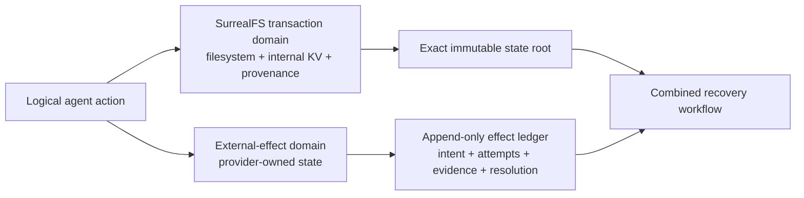
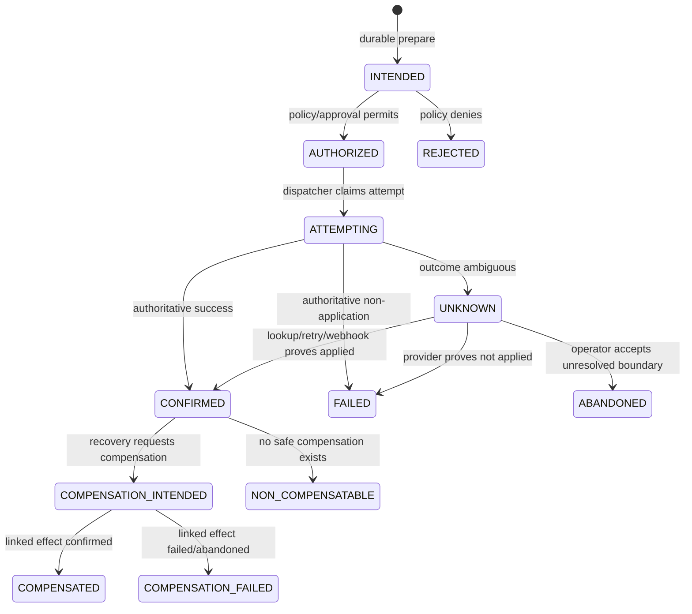

# External effects and recovery

Status: proposed canonical design  
Last updated: 2026-08-04

This document defines how SurrealFS combines exact restoration of SurrealFS-controlled state,
logical agent-action attribution, and reconciliation of effects in systems SurrealFS does not
control. It is deliberately narrower than distributed rollback and stronger than a disclaimer that
external effects are merely "best effort."

## Decision

SurrealFS will make this precise promise:

> **Exact restoration of SurrealFS-controlled filesystem/KV state, logical action attribution under
> controlled execution, and capability-aware reconciliation of external effects.**

It will not promise exact restoration of the external world. GitHub comments, deployments, emails,
payments, external database writes, and infrastructure mutations may be irreversible, temporarily
unobservable, or governed by provider-specific guarantees.

The combined recovery workflow is therefore causally coherent, not globally atomic:

1. restore or fork exact local state;
2. show which logical actions and external effects are implicated;
3. reconcile each effect using the strongest operation-specific mechanism available;
4. compensate where a separate compensating action exists;
5. expose unresolved and non-recoverable boundaries rather than hiding them.

## Why this is a product feature

An agent can fail after changing both local state and the outside world. A filesystem snapshot can
restore the files but cannot answer whether the failed action also opened a pull request, sent an
email, or triggered a deployment. A trace can show an attempted call but cannot prove the exact local
state published around it. A provider idempotency key may prevent a duplicate call but cannot restore
the agent's workspace or explain later dependencies.

SurrealFS should join those facts in one recovery view while preserving their different guarantees.
The useful outcome is not "everything rolled back." It is:

- exact local state at a chosen root;
- defensible attribution to a logical agent action;
- durable knowledge of external intent before controlled dispatch;
- explicit treatment of ambiguous outcomes;
- provider-aware retry, lookup, compensation, or human resolution;
- a recovery grade that states what is and is not repaired.

This is only differentiating if the implementation proves the hard failure windows. A UI that merely
places logs next to a restore button is not this design.

## Scope and terms

### Controlled state

State whose publication protocol SurrealFS owns:

- filesystem objects and metadata within the documented filesystem subset;
- internal KV records in a SurrealFS workspace;
- branches, commits, roots, receipts, provenance, policy evidence, and evaluation records.

SurrealFS can restore this state exactly to a previously acknowledged root, subject to the durability
mode reported by the corresponding receipt.

### External effect

A mutation whose authoritative state belongs to another system, including:

- creating or updating a GitHub issue, comment, branch, or pull request;
- sending an email or message;
- creating a payment or refund;
- starting, promoting, or deleting a deployment;
- changing cloud infrastructure;
- writing to a database outside the SurrealFS transaction domain;
- invoking an arbitrary tool whose effects cannot be completely observed.

An external read is recorded as an observation/dependency when capture permits. It is not an external
effect unless it also mutates remote state.

### Reconciliation

The process of determining the authoritative outcome of an external effect and choosing the next
safe action. Reconciliation may use a provider idempotency key, remote object identifier, lookup API,
correlation marker, signed webhook, a compensating operation, or human evidence.

### Compensation

A new external effect intended to counteract an earlier confirmed effect. Compensation is not
rollback: it can fail, be incomplete, have its own side effects, and leave an audit-visible history.

## Non-negotiable invariants

1. **Exact means local.** A local recovery claim always names the filesystem/KV root restored.
2. **Intent precedes dispatch.** No controlled external mutation is dispatched until its intent and
   request digest are durably recorded.
3. **External facts do not fork away.** Forking or restoring local state never deletes or rewrites the
   repository/run-global external-effect ledger.
4. **Unknown is a first-class outcome.** A lost response or crashed dispatcher is not silently
   classified as failed.
5. **Unknown is never blindly replayed.** Retry requires a valid idempotency guarantee, authoritative
   lookup, explicit operator decision, or policy-approved risk acceptance.
6. **Capabilities are per operation.** A provider is not globally "idempotent" or "compensatable."
7. **Compensation is another effect.** It receives its own intent, attempts, evidence, and outcome.
8. **Attribution is qualified.** SurrealFS reports the capture boundary and never claims completeness
   when credentials or network paths can bypass it.
9. **Local publication does not imply external success.** The two results are shown independently.
10. **A tool completion summary is not the ledger.** External intent must exist before dispatch, not
    first appear when a span finishes.

## Consistency model

There are two consistency domains:



The SurrealFS transaction can atomically publish local state and references to already-durable effect
records. It cannot atomically commit with arbitrary external providers. A controlled external
database could participate in a purpose-built two-phase protocol, but SurrealFS will not generalize
that exception into a universal transaction-manager claim.

A logical action may produce multiple local commits and multiple external effects. The action/span is
the causal container; it is not one cross-system ACID transaction.

## Ledger ownership and history

Filesystem/KV branches are forkable state. External effects are historical facts.

The external-effect ledger is append-only at repository or tenant scope and remains visible from all
recovery branches authorized to inspect the originating run. A recovery branch can annotate its
relationship to an effect but cannot make the effect disappear by choosing a parent commit from
before the dispatch.

Corrections are new records:

- a resolution corrects an earlier `UNKNOWN` classification;
- a provider webhook adds evidence;
- a compensation links to the confirmed effect it counters;
- an operator decision records who accepted risk and why;
- an administrative redaction may hide sensitive payload material but preserves identity, hashes,
  sequence, and audit evidence.

## Data model

The current `tool_call.external_effect_status` field is only a derived summary for display and
compatibility. It is insufficient as the system of record. The canonical model requires the following
first-class records.

### `external_effect`

One logical requested mutation:

```text
id
tenant_id, repository_id, run_id
trace_id, span_id, tool_call_id
provider, account_scope, region_or_endpoint
operation, target_digest
request_digest, request_schema_version
idempotency_mode, idempotency_scope, idempotency_expires_at
idempotency_key_ciphertext | deterministic_key_version
capability_manifest_hash
effect_class
status
prepared_at, authorized_at, terminal_at
policy_decision_id, approval_id
remote_object_type, remote_object_id
compensates_effect_id
capture_mode
created_sequence
```

The plaintext request body and idempotency key are not necessarily retained. The system must retain
enough protected material to retry safely or deterministically derive the same key. A hash alone does
not permit retry. Key material is bound to provider, account, region/endpoint, operation, effect ID,
and request digest. Reusing a key with a different request digest is rejected.

### `external_effect_attempt`

One dispatch or provider lookup attempt:

```text
id, effect_id, attempt_number
kind: DISPATCH | LOOKUP | RETRY | WEBHOOK | HUMAN_CHECK
request_digest, credential_binding
started_at, transport_completed_at
transport_outcome, provider_status
provider_request_id, remote_object_id
response_digest, evidence_artifact_id
error_class, retry_after
dispatcher_instance, sequence
```

Attempts are immutable. Provider response bodies should be encrypted, redacted, or stored as access-
controlled artifacts; the ledger keeps stable digests and essential identifiers.

### `external_effect_resolution`

An authoritative or policy-approved conclusion:

```text
id, effect_id
from_status, to_status
reason_code, reason
evidence_artifact_ids
source: PROVIDER_LOOKUP | IDEMPOTENT_RETRY | WEBHOOK | OPERATOR | POLICY
actor_id, policy_decision_id
resolved_at, sequence
```

Resolutions never overwrite attempts. An operator resolution is distinguishable from provider proof.

### Provider operation capability

Adapter manifests are versioned and hashed into each effect:

```text
provider, operation, manifest_version
idempotency_mode
idempotency_scope
idempotency_retention
same_key_parameter_matching
authoritative_lookup
lookup_consistency
webhook_support
compensation_operation
irreversibility
required_correlation_fields
```

Historical recovery uses the manifest version captured at prepare time, even if the adapter later
changes.

## Effect state machine



`FAILED` means there is authoritative evidence that the requested effect was not applied, not merely
that the client saw a timeout. `ABANDONED` means the ambiguity remains and a named actor or policy has
accepted that boundary. It must remain visible in every later recovery report.

The compensation statuses summarize a linked compensating effect. The underlying compensation still
uses the normal effect state machine, including `UNKNOWN`.

## Controlled dispatch protocol

### 1. Open and stage

The action opens workspace `W` at local state root `A` and stages filesystem/KV mutations privately.
No external guarantee is implied yet.

### 2. Prepare intent

`Effect.Prepare` validates the typed request, calculates the request and target digests, chooses an
operation capability manifest, allocates the effect ID/idempotency key, evaluates policy, and durably
stores `INTENDED` before any provider call.

Protected operations may remain in `INTENDED` pending approval. Denial moves them to `REJECTED`.

### 3. Authorize and dispatch

After authorization, a dispatcher with a scoped credential records an attempt and invokes the
provider. High-assurance mode routes the call through a SurrealFS credential/egress proxy so the agent
cannot obtain the raw provider credential or bypass recording.

### 4. Classify outcome

The dispatcher records:

- `CONFIRMED` when provider evidence proves the mutation was applied;
- `FAILED` when provider evidence proves it was not applied;
- `UNKNOWN` for timeouts, connection loss after possible send, dispatcher crash, malformed response,
  or any other ambiguity.

### 5. Reconcile ambiguity

The reconciler uses the captured capability manifest, in descending order of assurance:

1. authoritative lookup by provider request, idempotency, or remote object ID;
2. safe retry with the identical key and request digest within the provider's guarantee window;
3. lookup by a unique SurrealFS correlation marker;
4. signed/deduplicated webhook evidence;
5. operator investigation and explicit resolution or abandonment.

### 6. Publish local state

The workspace may publish root `B`, referencing the effect IDs and evidence known at commit time.
Policy decides whether local publication may proceed while an effect is `INTENDED`, `ATTEMPTING`, or
`UNKNOWN`. The default for protected workflows is to block publication on unresolved required effects.

Later effect resolutions do not rewrite commit `B`; they extend the ledger and its graph relations.

### 7. Recover

Recovery chooses an exact local root or creates a new branch, keeps the external-effect ledger intact,
then reconciles, compensates, or explicitly accepts each implicated external boundary.

## Failure-window requirements

| Failure window | Required durable state | Safe next action |
|---|---|---|
| Before intent commit | No effect exists and controlled dispatch did not occur | Prepare normally |
| After intent, before send | `INTENDED` or `AUTHORIZED`; zero provider attempts | Dispatch once under manifest policy |
| During request or after provider acceptance before response | Attempt exists; effect becomes `UNKNOWN` | Lookup or idempotent retry; never infer failure |
| Response received before local outcome commit | Attempt exists; effect becomes `UNKNOWN` on lease expiry/restart | Reconcile from provider evidence |
| Effect confirmed before local workspace publish | Confirmed effect remains globally visible; local branch still at old root | Preserve staged workspace, fork/retry local publish, or compensate |
| Local publish conflicts after effect dispatch | External effect remains; rejected local CAS is recorded | Rebase/fork with explicit effect relationship; do not redispatch blindly |
| Crash while compensating | Original effect remains confirmed; compensation may be `UNKNOWN` | Reconcile the linked compensation effect |
| Webhook duplicated or delivered out of order | Provider event ID and signed evidence are deduplicated | Apply only a valid monotonic resolution |

The dispatcher uses leases for work ownership, but a lease expiry never proves a provider mutation did
not occur. Concurrency control prevents two active workers from intentionally dispatching the same
effect; provider idempotency remains necessary for crash races.

## Provider capability tiers

SurrealFS grades each operation, not each vendor:

### Tier 1: provider-idempotent

The provider documents same-key behavior, scope, retention window, and parameter-mismatch behavior.
SurrealFS can retry the identical request inside that boundary. It still records and discloses expiry,
account/region scope, and any response replay limitations.

### Tier 2: application-reconcilable

The provider lacks a suitable idempotency contract, but the operation can carry a unique SurrealFS
marker and can be queried afterward. For example, a created comment could include a hidden correlation
marker. Lookup may be eventually consistent and duplicates may still be possible, so the UI cannot
label this exactly-once.

### Tier 3: compensatable

The applied mutation can be countered by a separate supported operation, such as cancel, revert,
delete, refund, or redeploy. The compensation may not restore every consequence and has its own
failure modes.

### Tier 4: non-compensatable or unreconcilable

The effect cannot be reliably queried, deduplicated, or undone. Examples can include already delivered
email, human actions, and arbitrary shell commands. Protected mode requires pre-dispatch approval or
denies the operation. Recovery can only expose evidence and the explicit boundary.

An operation may have more than one property—for example provider-idempotent creation plus a separate
compensation operation. The manifest records the exact composition.

## Recovery workflow and grades

Recovery starts from a failed/suspect logical action and produces a report with two independent
sections:

### Local state

- before and after filesystem/KV roots;
- selected restore/fork root;
- exact verification result;
- implicated commits, paths, keys, and artifacts;
- downstream actions selected for rerun or transplant;
- read-capture level supporting the dependency analysis.

### External state

- every linked effect and current state;
- provider capability manifest and guarantee window;
- attempts and evidence;
- recommended/allowed next action;
- compensation outcome;
- unresolved or accepted divergence.

The workflow ends with one of these user-visible grades:

| Grade | Meaning |
|---|---|
| `LOCAL_EXACT` | The selected filesystem/KV root is exact; there were no linked external mutations |
| `LOCAL_EXACT_EXTERNAL_CONSISTENT` | Local root is exact and all effects match the recovery target or policy |
| `LOCAL_EXACT_EXTERNAL_COMPENSATED` | Local root is exact and all conflicting compensatable effects were confirmed compensated |
| `LOCAL_EXACT_EXTERNAL_DIVERGED` | Local root is exact, but one or more confirmed/non-compensatable effects remain outside the target state |
| `BLOCKED_UNKNOWN_EXTERNAL` | Local recovery is available, but policy blocks completion because an external outcome is ambiguous |
| `BEHAVIOR_NOT_REPRODUCIBLE` | State is restorable, but missing inputs, nondeterminism, or incomplete capture prevent behavioral replay claims |

No grade named simply `RECOVERED` is allowed because it would collapse materially different
guarantees.

### Selective recovery constraint

SurrealFS may safely transplant later independent work only when dependency capture justifies that
claim. Capture levels remain `none`, `semantic`, `filesystem`, `strict`, and `summarized` as defined in
the commit protocol. Insufficient capture requires a conservative fork and downstream rerun; the UI
must not present a guessed dependency set as proof of independence.

## Attribution and the capture boundary

Logical attribution is feasible when mutations pass through a controlled workspace and execution
identity:

- the daemon issues a workspace capability bound to repository, base root, principal, run, span, and
  process lineage;
- filesystem/KV publication requires that capability;
- tool and subprocess boundaries propagate the action identity;
- direct SDK callers provide verified trace/span context;
- effect dispatch uses a typed adapter or proxy associated with the same identity.

It is not complete when an agent can write the repository through another path, obtain raw provider
credentials, or use unrestricted network egress. Capture quality must therefore be reported:

| Mode | External-effect attribution claim |
|---|---|
| `ENFORCED` | Typed adapter/credential proxy and egress policy prevent supported-provider bypass |
| `OBSERVED` | SDK or wrapper records cooperative calls, but bypass is possible |
| `DECLARED` | Tool self-reports effects after execution; useful but not authoritative |
| `UNKNOWN` | Arbitrary egress or credentials make completeness unknowable |

Even `ENFORCED` applies only to the declared sandbox/host/network boundary. SurrealFS must name that
boundary in receipts and recovery reports.

## Security and policy

- Provider credentials are held by a scoped dispatcher/proxy, not written into the agent workspace.
- Effect requests use typed schemas with allowlisted destinations and operations.
- Request/response payloads are minimized, encrypted, redacted, or stored as protected artifacts.
- Idempotency keys and remote identifiers are treated as sensitive correlation material.
- The effect ledger is tenant-isolated and append-only under normal operation.
- Irreversible Tier 4 effects require approval in protected mode.
- Policy selects whether `UNKNOWN` blocks local publication, release advancement, or only workflow
  completion.
- Operator resolution stores identity, reason, evidence, and policy decision.
- Direct network access or credential escape downgrades the capture claim and produces a visible risk
  finding.

## Required API changes

The following conceptual APIs are required; transport spelling may differ:

```text
Effect.Prepare(run, span, tool_call, provider_operation, typed_request, policy_context)
    -> EffectIntent

Effect.Dispatch(effect_id, expected_request_digest)
    -> EffectOutcome | UNKNOWN

Effect.Get(effect_id)
Effect.List(run_id | span_id | recovery_id, filters)
Effect.Reconcile(effect_id, strategy?)
    -> ReconciliationResult

Effect.Compensate(effect_id, compensation_request, policy_context)
    -> linked EffectIntent

Effect.Resolve(effect_id, conclusion, evidence, operator_context)
    -> ExternalEffectResolution
```

`Effect.Dispatch` should normally be available only to the trusted dispatcher. The agent SDK prepares
typed intent and receives an outcome. `Span.Finish(... external_effects)` remains a summary/reference
mechanism and cannot be the first time an external effect is reported.

Recovery APIs need to return both the local plan and external obligations:

```text
Recovery.Plan(suspect_action, target?)
    -> local_root_plan
     + downstream_dependency_plan
     + external_effect_obligations
     + predicted_recovery_grade

Recovery.Execute(plan_id, approvals)
    -> exact_local_verification
     + effect_reconciliation_results
     + final_recovery_grade
```

## User experience requirements

The workflow demo and production UI must show:

1. the failed logical action and exact before/after local roots;
2. a timeline of prepared, attempted, confirmed, unknown, or compensated effects;
3. the capability and capture grade behind every proposed retry;
4. a forced `UNKNOWN` failure window and its reconciliation path;
5. a forked/restored local state where the external fact remains visible;
6. a separate compensation with its own outcome;
7. an explicit non-recoverable example;
8. the final recovery grade and remaining divergence.

Wording rules:

- say **restore local state**, not **undo the action**, when external effects remain;
- say **compensated**, not **rolled back**, for a counteracting external operation;
- say **confirmed once within provider guarantee**, not **exactly once**, unless the complete end-to-end
  protocol proves that term;
- say **unknown**, not **failed**, after an ambiguous transport outcome.

## Proof plan

### Test fixtures

1. **Deterministic fake provider:** controllable failpoints before send, after receive, after apply,
   before response, after response, and during lookup/compensation.
2. **Strong-idempotency integration:** a test/sandbox operation with a documented idempotency contract.
3. **Weak-reconciliation integration:** an operation reconciled using a SurrealFS correlation marker
   and provider lookup.
4. **Non-compensatable fixture:** demonstrates approval and persistent divergence rather than fake
   rollback.

### Required invariants

- No controlled dispatch occurs without a durable intent.
- Replaying the same effect with a different request digest is rejected.
- Strong-idempotency tests produce no duplicate effect inside the documented provider guarantee.
- Weak-reconciliation ambiguity never triggers a blind replay.
- Every response-loss window becomes `UNKNOWN` until evidence resolves it.
- Exact local root restoration succeeds independently of external outcomes.
- Forking before an effect never removes it from the ledger or recovery view.
- Compensation is stored and failed independently from the original effect.
- Webhook duplicates and reordering do not corrupt the state machine.
- Selective recovery is refused when dependency capture is insufficient.
- Raw credential/egress bypass downgrades capture completeness.
- UI/API output never represents a divergent or unknown external state as globally recovered.

### Phase exit criteria

The combined claim is not ready for the product pitch as a shipped capability until:

1. crash tests cover every row in the failure-window table;
2. the immutable effect ledger and local commit graph can be queried together;
3. at least one Tier 1 and one Tier 2 operation pass integration tests;
4. protected mode proves pre-dispatch approval for an irreversible effect;
5. a recovery demo ends in each applicable recovery grade;
6. logical export preserves effect records, manifests, links, and evidence digests;
7. security review validates credential isolation and the stated bypass boundary.

Until then, documentation should call this a proposed differentiator rather than an established moat.

## Delivery sequence

### Phase A: protocol proof

- first-class effect/attempt/resolution records;
- fake provider and crash matrix;
- `Prepare`, trusted dispatch, `UNKNOWN`, lookup, and operator resolution;
- recovery report showing exact local root plus persistent external facts.

### Phase B: supported adapters

- versioned per-operation capability manifests;
- one provider-idempotent integration;
- one marker/lookup reconciliation integration;
- webhook evidence and deduplication;
- compensation as a linked effect.

### Phase C: enforcement and recovery intelligence

- credential/egress proxy and capture grading;
- policy-driven approval and publication blocking;
- downstream dependency analysis and conservative selective recovery;
- final recovery grades and operator workflow.

### Phase D: defensibility

- public conformance suite for adapters and failure windows;
- portable evidence export;
- signed receipts/checkpoints where required;
- measured recovery success, ambiguity duration, duplicate prevention, and operator burden across real
  workloads.

## Non-goals

- universal ACID transactions across SurrealFS and arbitrary providers;
- automatic reversal of email, human decisions, or irreversible infrastructure changes;
- claiming exactly-once delivery for providers that do not offer the necessary primitive;
- silently retrying unknown non-idempotent effects;
- inferring complete attribution from timestamps alone;
- implementing a generic distributed transaction coordinator for external databases;
- hiding divergence to produce a cleaner recovery status.

## Evidence behind the capability model

The operation-specific model is intentional. Real providers expose materially different guarantees:

- [Stripe idempotent requests](https://docs.stripe.com/api/idempotent_requests) document key reuse,
  retention, and parameter comparison behavior.
- [Amazon EC2 API idempotency](https://docs.aws.amazon.com/ec2/latest/devguide/ec2-api-idempotency.html)
  distinguishes client-token behavior and regional/zonal scope.
- [GitHub issue comments](https://docs.github.com/en/rest/issues/comments) expose create and lookup APIs
  but do not constitute a general exactly-once transaction with SurrealFS.
- [Stripe webhook guidance](https://docs.stripe.com/webhooks) illustrates duplicate delivery,
  signature verification, and asynchronous evidence handling.
- [PostgreSQL `PREPARE TRANSACTION`](https://www.postgresql.org/docs/current/sql-prepare-transaction.html)
  shows that two-phase commit is a participant-specific mechanism with operational constraints, not a
  substitute for reconciling arbitrary APIs.

These references inform adapter manifests. They do not elevate any provider guarantee beyond the
specific operation, scope, retention window, and account configuration verified by the adapter.

## Relationship to other documents

- [Product contract](02-product-contract.md) defines the customer-visible guarantee boundary.
- [Commit protocol](05-commit-protocol.md) defines exact local publication and dependency capture.
- [Execution graph](07-execution-graph.md) defines the causal links among actions and effects.
- [API and SDK design](09-api-and-sdk.md) owns the public transport surface.
- [Security and tenancy](10-security-and-tenancy.md) owns credentials, policy, isolation, and audit.
- [Testing and benchmarks](12-testing-and-benchmarks.md) turns this proof plan into executable gates.
- [ADR 0005](adr/0005-transactional-workspaces-and-attribution.md) defines the controlled workspace and
  attribution boundary.

