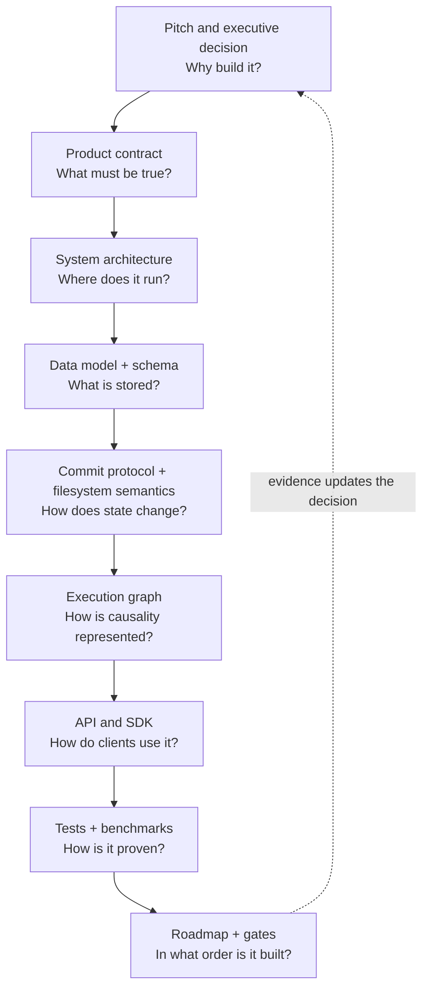
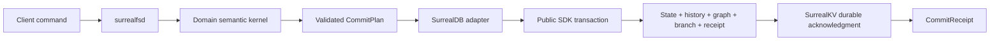

# SurrealFS documentation guide

You do not need to read every document. Choose the path that matches the decision you need to make.

## Three reading paths

### 1. Team decision — about 25 minutes

For product, engineering, and leadership discussion:

1. [Team pitch](../PITCH.md) — problem, product, moat, design, evidence, and the investment ask.
2. [Executive decision](00-executive-decision.md) — the exact recommendation and go/no-go gates.
3. [Roadmap: Phase 0](13-roadmap.md#phase-0--proof-package) — what the first funded proof delivers.
4. [Highest-priority risks](14-risk-register.md#highest-priority-risks-before-writing-production-code)
   — what can invalidate the proposal.

Stop there unless you are reviewing implementation details.

### 2. Core implementation — engineering sequence

For the engineers building the vertical slice, read in this order:

1. [Product contract](02-product-contract.md) — what the system promises and explicitly does not.
2. [System architecture](03-system-architecture.md) — processes, boundaries, write/read paths, and
   deployment.
3. [Canonical data model](04-data-model.md) — IDs, records, relations, history, roots, and indexes.
4. [Commit protocol](05-commit-protocol.md) — atomicity, retries, conflicts, durability, and recovery.
5. [Execution graph](07-execution-graph.md) — how actions, commits, artifacts, policies, and
   evaluations connect.
6. [SurrealDB + SurrealKV contract](08-surrealdb-surrealkv.md) — adapter boundary and engine rules.
7. [API and SDK design](09-api-and-sdk.md) — commands, queries, transactions, subscriptions, and
   errors.
8. [Testing and benchmarks](12-testing-and-benchmarks.md) — executable proof of the above.
9. [Detailed roadmap](13-roadmap.md) — implementation order and exit criteria.

Read [filesystem semantics](06-filesystem-semantics.md) before implementing filesystem operations,
and [security and tenancy](10-security-and-tenancy.md) before accepting real customer data.

### 3. Storage-engine review — focused audit

For database, reliability, security, and legal reviewers:

1. [Executive decision](00-executive-decision.md)
2. [SurrealDB + SurrealKV operating contract](08-surrealdb-surrealkv.md)
3. [Current private-source audit](15-current-surrealdb-audit.md)
4. [Commit protocol](05-commit-protocol.md)
5. [Testing and benchmarks](12-testing-and-benchmarks.md)
6. [Risk register](14-risk-register.md)
7. [ADR 0001](adr/0001-surrealdb-surrealkv-canonical.md)

## How the implementation design fits together

The pitch does not replace the implementation design. The design descends from promises to code and
then back to evidence:

There is one core implementation path:

The semantic kernel owns filesystem and causal rules. The adapter owns schema/query translation and
error mapping. The daemon owns the database directory and process lifecycle. Clients never open the
store or mutate SurrealFS tables directly.

## Canonical source for each design question

| Question | Canonical document | Concrete artifact |
|---|---|---|
| What is the product/moat? | [The moat](01-moat.md) | [Team pitch](../PITCH.md) |
| What does SurrealFS guarantee? | [Product contract](02-product-contract.md) | Acceptance gates in the same document |
| Which components own which behavior? | [System architecture](03-system-architecture.md) | Initial crate layout in [PLAN.md](../PLAN.md#initial-repository-layout-for-implementation) |
| Which records and relations exist? | [Data model](04-data-model.md) | [Draft SurrealQL schema](../schema/001-core.surql) |
| How is one atomic change committed? | [Commit protocol](05-commit-protocol.md) | Transaction tests in [testing](12-testing-and-benchmarks.md) |
| What are file/KV semantics? | [Filesystem semantics](06-filesystem-semantics.md) | Model/property tests in [testing](12-testing-and-benchmarks.md) |
| How is causality queried? | [Execution graph](07-execution-graph.md) | [Product queries](../schema/product-queries.surql) |
| Why and how is the database used? | [Engine contract](08-surrealdb-surrealkv.md) | [Current code audit](15-current-surrealdb-audit.md) |
| What is the client surface? | [API and SDK design](09-api-and-sdk.md) | Protocol conformance fixtures planned in [PLAN.md](../PLAN.md) |
| How is customer data protected? | [Security and tenancy](10-security-and-tenancy.md) | Security gates in that document |
| How does AgentFS data move? | [Migration](11-migration.md) | Neutral migration bundle specification |
| How is correctness proven? | [Testing and benchmarks](12-testing-and-benchmarks.md) | Crash, model, conformance, and workload suites |
| What gets built first? | [Roadmap](13-roadmap.md) | Phase exit and stop criteria |
| What can invalidate the design? | [Risk register](14-risk-register.md) | Named owners, indicators, and contingencies |

## Complete reference catalog

### Decision and product

- [Team pitch](../PITCH.md)
- [Executive decision](00-executive-decision.md)
- [The moat](01-moat.md)
- [Product contract](02-product-contract.md)

### Implementation design

- [System architecture](03-system-architecture.md)
- [Canonical data model](04-data-model.md)
- [Commit protocol](05-commit-protocol.md)
- [Filesystem semantics](06-filesystem-semantics.md)
- [Execution graph](07-execution-graph.md)
- [SurrealDB + SurrealKV operating contract](08-surrealdb-surrealkv.md)
- [API and SDK design](09-api-and-sdk.md)
- [Draft SurrealQL schema](../schema/001-core.surql)
- [Product queries](../schema/product-queries.surql)

### Delivery and assurance

- [Security and tenancy](10-security-and-tenancy.md)
- [Migration from AgentFS](11-migration.md)
- [Testing and benchmarks](12-testing-and-benchmarks.md)
- [Detailed roadmap](13-roadmap.md)
- [Risk register](14-risk-register.md)
- [Current private-source audit](15-current-surrealdb-audit.md)
- [Master plan](../PLAN.md)

### Decisions and terminology

- [ADR 0001: canonical store](adr/0001-surrealdb-surrealkv-canonical.md)
- [ADR 0002: application commits](adr/0002-application-commits.md)
- [ADR 0003: single semantic writer](adr/0003-single-semantic-writer.md)
- [Glossary](glossary.md)
- [Contributing](../CONTRIBUTING.md)

## Editing rule

When a decision changes, update its canonical document first, then update the pitch/README summary,
schema or queries, tests/gates, risk entry, and ADR if the decision boundary changed. This prevents a
short presentation document from silently becoming a competing architecture.
